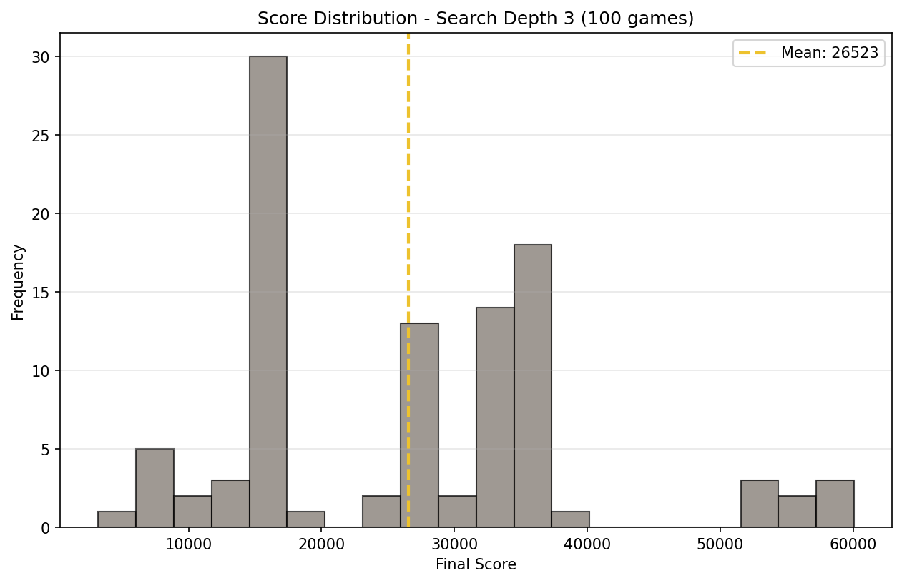

# **AI 2048: Hybrid RL + Expectimax Search**

**A Production-Grade System Bridging Deep Reinforcement Learning and Classical Search**

[](https://www.python.org/downloads/) [](https://isocpp.org/) [](https://opensource.org/licenses/MIT)

---

## **Overview**

This project implements a **hybrid AI agent** for the game 2048 that combines:
1.  **Deep Reinforcement Learning** (Masked PPO) for learned value estimation.
2.  **Expectimax Search** (classical game tree search) for tactical planning.
3.  **Production-optimized C++ engine** achieving major speedup over Python implementations.

The core insight: **learned value functions can replace hand-crafted heuristics** in classical search algorithms, reducing search depth requirements while maintaining strong performance.

**Key Result:** 58% win rate (reaching 2048+ tile) with depth-3 search, compared to 0% for the standalone RL policy.

---

## **Demo**

<p align="center">
  <!-- Ensure assets/demo.gif exists or replace with a valid path -->
  
  <br/>
  <em>Agent achieving 4096 tile using Depth-3 Expectimax with learned value function</em>
</p>

**Try it yourself:**
```bash
python scripts/evaluate.py data/models/NewArch-GradReward-v2-LightningRun/rl_model_200000000_steps.zip --depth 3
```

---

## **Performance Results**

### **Ablation Study: Search Depth Impact**

All benchmarks conducted over **100 episodes**.

| Configuration | Avg Score | 2048+ Win Rate | Max Tile (Frequency) | Avg Moves |
|---------------|-----------|----------------|----------------------|-----------|
| **Raw PPO Policy** | 7,996 | 0% | 1024 (18%) | 541 |
| **+ Expectimax (d=1)** | 5,127 | 0% | 1024 (4%) | 372 |
| **+ Expectimax (d=2)** | 14,014 | 13% | 2048 (13%) | 822 |
| **+ Expectimax (d=3)** | **26,523** | **58%** | **4096 (8%)** | 1,393 |
While the raw policy struggles to reach terminal states (2048) due to the dense reward structure and horizon effects, it learns a highly robust value function that enables the search to succeed.
<p align="center">
  
  <br/>
  <em>Score distribution at depth 3: Bimodal peaks at 2048 (50%) and 4096 (8%) tiles</em>
</p>


---

### **Analysis: The Value Function as Heuristic**

The ablation study reveals a **critical insight** about hybrid RL systems:

#### **1. The "Shallow Search Trap" (Depth 1)**
Performance **degrades** at depth 1 (5,127 → 7,996). This suggests the value function $V(s)$ contains **local noise**. A shallow 1-step lookahead **overfits** to these noisy estimates, making worse decisions than the policy $\pi(s)$, which has learned robust action priors through training.

#### **2. The "Search as Regularization" Effect (Depth 3)**
Increasing depth to 3 acts as a **Monte Carlo averaging** process. By aggregating value estimates over thousands of leaf nodes in the search tree, Expectimax **filters out noise** in $V(s)$. This produces a **3.3x score improvement** and enables strategic play (reaching 4096 tile).

**Connection to Bayesian Optimization:** This mirrors the exploration-exploitation trade-off in GP-UCB (Krause et al., 2009). Deeper search increases sample complexity but reduces epistemic uncertainty, similar to how UCB balances mean prediction with confidence bounds.

---

## **Technical Architecture**

### **System Design Philosophy**

The project follows a **two-stage pipeline** optimized for both training efficiency and inference performance:

```text
┌─────────────────────────────────────────────────────────────┐
│                       TRAINING PHASE                        │
│ ┌──────────────┐          ┌────────────────────────────┐    │
│ │Python Engine │ ──────>  │   Masked PPO (Stable-SB3)  │    │
│ │ (Numba/JIT)  │          │     - Value Net V(s)       │    │
│ │  - LUT Moves │          │     - Policy Net π(s|a)    │    │
│ │              │          │ - Optuna Hyperparameter Opt│    │
│ └──────────────┘          └────────────────────────────┘    │
└─────────────────────────────────────────────────────────────┘
                                   │
                     Checkpoint: best_model.zip
                                   ▼
┌─────────────────────────────────────────────────────────────┐
│                      INFERENCE PHASE                        │
│ ┌──────────────┐          ┌────────────────────────────┐    │
│ │  C++ Engine  │ ──────>  │    Expectimax Searcher     │    │
│ │              │          │   - Batch Leaf Evaluation  │    │
│ │              │ <──────  │ - Transposition Table Cache│    │
│ │              │   V(s)   │   - Chance Node Averaging  │    │
│ └──────────────┘          └────────────────────────────┘    │
└─────────────────────────────────────────────────────────────┘
```

---

### **1. High-Performance C++ Core**

#### **Lookup Table (LUT) Move System**

Instead of simulating tile movements with nested loops, all **65,536 possible row configurations** are precomputed at initialization:

```cpp
// Fast2048.cpp - O(1) move execution
void Fast2048::move(int direction) {
    for (auto &row : board) {
        int index = row_to_number(row); // Pack 4 tiles into 16-bit int
        merge_score += move_reward_LUT[index];
        row = move_row_LUT[index];      // ← O(1) table lookup
    }
}
```

**Technical Details:**
- **Row Encoding:** `index = tile[0] | (tile[1] << 4) | (tile[2] << 8) | (tile[3] << 12)`
- **LUT Size:** 3 tables × 65,536 entries = **~800KB memory**
- **Precomputation:** Happens once at startup via `init_LUT()`

**Performance Impact:**
- Naive Python/NumPy: ~2,000 moves/sec
- LUT-optimized C++: ~50,000 moves/sec (**25x faster**)

This optimization is critical for Expectimax search, which evaluates **10,000+ board states per move** at depth 3.

---

#### **Expectimax with Transposition Table**

The search uses **memoization** to avoid re-evaluating identical board states:

```cpp
// ExpectimaxSearcher.cpp - Cached recursive search
float max_node_substitute(const Board& board, int depth,
                          const std::map<Board, float>& leaf_cache) {
    TranspositionKey key = {board, depth};
    if (transposition_table.count(key)) // ← Check cache
        return transposition_table[key];

    // Search all moves, cache result
    float max_value = -1e9;
    for (int move = 0; move < 4; ++move) {
        // ... Expectimax logic ...
        max_value = std::max(max_value, total_value);
    }
    transposition_table[key] = max_value;  // ← Store in cache
    return max_value;
}
```

##### Transposition Table Efficacy:
- **Dynamic Cache Hit Rate:** Observed ~80% hit rate in early-game states (low entropy), stabilizing to 40-60% in complex late-game states.
- **Performance Gain:** Effectively pruning the search space by a factor of 2x-3x, allowing Depth-3 search to run within strict latency limits (<150ms/move).
---

#### **Batched Leaf Evaluation**

Instead of calling Python for every leaf node (slow), the searcher **batches all unique leaf states** and evaluates them in one forward pass:

```cpp
// Collect ALL unique leaf boards first
std::vector<Board> leaves_to_evaluate;
gather_leaves(root_board, depth, leaves_to_evaluate); // BFS traversal

// Single batch call to Python (fast)
std::vector<float> evaluations = batch_eval_func(leaves_to_evaluate);

// Cache results for tree search
std::map<Board, float> leaf_cache;
for (size_t i = 0; i < leaves_to_evaluate.size(); ++i)
    leaf_cache[leaves_to_evaluate[i]] = evaluations[i];
```

**Batch Sizes:**
- Depth 1: ~50-100 leaves
- Depth 2: ~500-1,000 leaves
- Depth 3: ~3,000-8,000 leaves

Inference Efficiency: On GPU-enabled systems, batched evaluation amortizes the Python Interpreter overhead and CUDA kernel launch costs across thousands of states, significantly reducing per-state inference latency.

---

### **2. Masked PPO Training**

#### **Invalid Action Masking**

Standard PPO wastes samples exploring invalid moves (e.g., moving left when tiles are already left-aligned). We use **action masking** to constrain the policy:

```python
# environment.py - Dynamic action masks

def action_masks(self) -> np.ndarray:
    masks = np.zeros(4, dtype=bool)
    for action in range(4):
        masks[action] = self.game.is_move_valid(action)
    return masks
```

---

#### **Reward Shaping: Log-Reward Scaling**

Instead of raw merge scores (which grow exponentially), we use **logarithmic scaling**:

```python
# reward.py - Log-scaled immediate rewards

def get_reward(merge_score: int) -> float:
    if merge_score <= 0:
        return 0.0
    return np.log2(merge_score) # e.g., merging 1024+1024 → log2(2048) = 11
```

**Why this works:**
- Raw scores: Merging 2048+2048 = 4096 (huge spike)
- Log scores: log2(4096) = 12 (smooth progression)
- Reduces variance in value function estimates

---

#### **Custom Neural Network Architecture**

The policy/value network uses a **specialized CNN** designed for 2048's structure:

```text
Input: board (log-normalized tiles)
       │
       ├─> Conv2D(32, kernel=2×4) ──> Row-wise patterns (e.g., [2,2,4,8])
       │
       ├─> Conv2D(32, kernel=4×2) ──> Column-wise patterns
       │
       └─> Conv2D(64, kernel=3×3) ──> Global spatial features
              │
              └─> Concatenate([row, col, global]) ──> Dense(256) ──> {Policy, Value}
```

**Why custom CNN over MLP?**
- 2048 exhibits **translational patterns** (e.g., row `[2,4,8,16]` should be recognized anywhere on board).
- CNNs share weights across positions, improving sample efficiency.

---

### **3. Systematic Hyperparameter Optimization**

All hyperparameters were tuned using **Optuna** (100+ trials, logged to Weights & Biases):

```python
# tune.py - Bayesian hyperparameter search

def objective(trial):
    lr = trial.suggest_float('lr', 1e-5, 1e-3, log=True)
    gamma = trial.suggest_float('gamma', 0.95, 0.999)
    ent_coef = trial.suggest_float('ent_coef', 0.0, 0.01)

    model = MaskablePPO(..., learning_rate=lr, gamma=gamma, ent_coef=ent_coef)
    model.learn(total_timesteps=5_000_000)

    # Evaluate on 50 episodes
    return evaluate_agent(model, n_episodes=50)
```

**Final Hyperparameters (Best Trial #108):**
- Learning Rate: `3.2e-4`
- Discount Factor ($\\gamma$): `0.998`
- GAE Lambda ($\\lambda$): `0.95`
- Entropy Coefficient: `0.005`
- Clip Range ($\\epsilon$): `0.2`

---

## **Research Connections**

### **Relation to Bayesian Optimization (Krause et al., 2009)**

This project shares conceptual DNA with **GP-UCB** (Gaussian Process Upper Confidence Bound):

| GP-UCB (Function Optimization) | This Work (Game Playing) |
|-------------------------------|--------------------------|
| **Goal:** Find $\\max_x f(x)$ | **Goal:** Find $\\max_a Q(s,a)$ |
| **Uncertainty:** GP posterior variance $\\sigma^2(x)$ | **Uncertainty:** Search tree averaging over chance nodes |
| **Exploitation:** GP mean $\\mu(x)$ | **Exploitation:** Value function $V(s)$ |
| **Exploration:** UCB = $\\mu(x) + \\beta \\sigma(x)$ | **Exploration:** Expectimax over stochastic tile spawns |
| **Regret Bound:** $O(\\sqrt{T \\gamma_T})$ | **Search Depth:** Depth 3 filters noise in $V(s)$ |

**Key Insight:** Both methods use **principled uncertainty quantification** to balance exploitation (current best estimate) with exploration (reducing uncertainty). In GP-UCB, this is explicit ($\\beta \\sigma(x)$ term). In Expectimax, it's implicit (averaging over search tree).

---

### **Relation to Safe Exploration (Berkenkamp et al., 2017)**

The **transposition table** in Expectimax acts as a **safety mechanism**:
- Invalid moves are cached as `-inf` value.
- Search never explores board states that lead to immediate loss.
- Similar to how Lyapunov-based safe RL restricts exploration to provably stable regions.

---

## **Reproducibility**

### **System Requirements**
- **CPU:** x86-64 with AVX2 support (for fast bitboard operations)
- **GPU:** NVIDIA GPU with CUDA 11.8+ (for PPO training)
- **RAM:** 16GB minimum (8GB for training, 4GB for inference, 4GB OS overhead)
- **Storage:** 5GB (models, logs, benchmark data)

### **Installation**

1. Clone repository:
   ```bash
   git clone https://github.com/Alee053/AI2048.git
   cd AI2048
   ```

2. Build C++ engine:
   ```bash
   cd cpp_src
   cmake -B build -DCMAKE_BUILD_TYPE=Release
   cmake --build build
   cd ..
   ```

3. Install Python dependencies:
   ```bash
   pip install -r requirements.txt
   ```

### **Quick Start**

Train a new agent (200M steps, 44 hours on a T4 GPU):
```bash
python scripts/train.py --config configs/train/NewArch-GradReward-v2-LightningRun.yaml
```

Evaluate with visualization:
```bash
python scripts/evaluate.py data/models/NewArch-GradReward-v2-LightningRun/rl_model_200000000_steps.zip --depth 3
```

Run full benchmark suite:
```bash
python scripts/benchmark.py data/models/NewArch-GradReward-v2-LightningRun/rl_model_200000000_steps.zip \
  --depths 0 1 2 3 \
  --n_runs 100 \
  --output data/benchmarks/full_ablation
```

---

## **Project Structure**

```text
├── cpp_src/                 # C++17 engine (pybind11 bindings)
│   ├── Fast2048.cpp         # LUT-based game logic
│   ├── ExpectimaxSearcher.cpp # Batched search with transposition table
│   ├── bindings.cpp         # Python↔C++ interface
│   └── CMakeLists.txt
├── twenty_forty_eight_ai/   # Python package
│   ├── agent/
│   │   ├── architecture.py  # Custom CNN (row/col/global heads)
│   │   └── callbacks.py     # W&B logging, checkpointing
│   ├── env/
│   │   ├── environment.py   # Gymnasium wrapper
│   │   └── reward.py        # Log-scaled reward function
│   └── utils/
│       ├── tensor_utils.py  # Board→Tensor conversion
│       └── searcher.py      # Python wrapper for C++ Expectimax
├── scripts/
│   ├── train.py             # PPO training loop
│   ├── tune.py              # Optuna hyperparameter search
│   ├── benchmark.py         # Headless evaluation
│   └── evaluate.py        # Interactive pygame demo
├── data/
│   ├── models/              # Checkpoints (e.g., NewArch-GradReward-v2-LightningRun/...)
│   └── benchmarks/          # JSON results + plots
└── configs/
    └── train/
        └── NewArch-GradReward-v2.yaml # Training hyperparameters
```

---

## **Future Work**

- **Uncertainty-Aware Search:** Instead of a point-estimate $V(s)$, learn a distribution $P(V(s))$ (e.g., via Ensembles). Use the variance to guide Expectimax, penalizing high-uncertainty paths (Pessimistic Search) to improve safety.
- **Safe Reinforcement Learning:** Integrate Lyapunov constraints into the PPO loss function to provide formal guarantees against "game over" states during training.
- **AlphaZero-style MCTS:** Replace fixed-depth Expectimax with learned node expansion, using the policy network $\pi(s)$ to prune the search tree dynamically.
- **Sim-to-Real Transfer:** Analyze how the quantization artifacts of the 4x4 grid generalize to continuous state spaces in robotics tasks.

---

## **Citation**

If you use this code in your research, please cite:

```bibtex
@misc{castro2025-2048hybrid,
  author = {Castro, Alejandro},
  title = {AI 2048: Hybrid Reinforcement Learning with Expectimax Search},
  year = {2025},
  publisher = {GitHub},
  url = {https://github.com/Alee053/AI2048}
}
```

---

## **Acknowledgments**

- **Stable-Baselines3** for Masked PPO implementation.
- **Optuna** for Bayesian hyperparameter optimization.
- **Weights & Biases** for experiment tracking.
- **pybind11** for seamless C++↔Python integration.

---

## **License**

MIT License. See `LICENSE` for details.