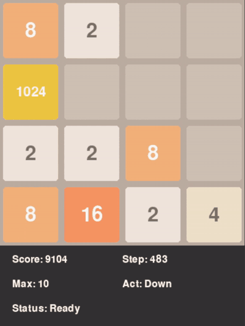
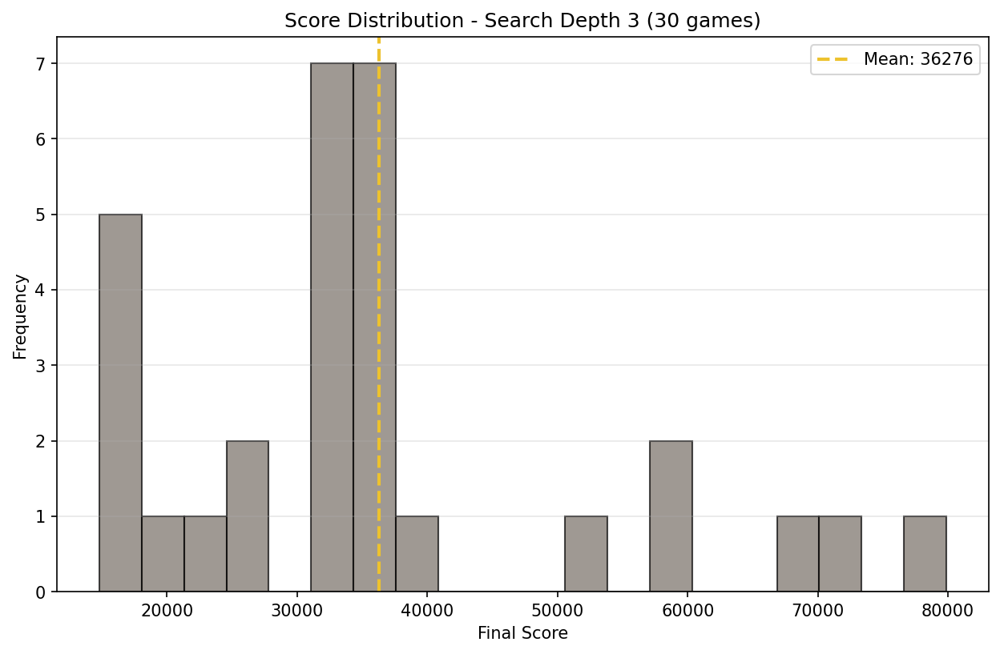

# **AI 2048: Hybrid RL + Expectimax Search**

**A Production-Grade System Bridging Deep Reinforcement Learning and Classical Search**

[](https://www.python.org/downloads/) [](https://isocpp.org/) [](https://opensource.org/licenses/MIT)

---
## **Quick Links**
- [Demo](#demo) | [Benchmarks](#performance-results) | [Installation](#installation) | [CLI Docs](#command-line-interface) | [Seed Sweeps](#seed-sweep-training) | [Aggregation](#post-processing-aggregation)

## **Overview**

This project implements a **hybrid AI agent** for the game 2048 that combines:
1.  **Deep Reinforcement Learning** (Masked PPO) for learned value estimation.
2.  **Expectimax Search** (classical game tree search) for tactical planning.
3.  **Production-optimized C++ engine** achieving major speedup over Python implementations.

The core insight: **learned value functions can replace hand-crafted heuristics** in classical search algorithms, reducing search depth requirements while maintaining strong performance.

**Key Result (v3, D4-augmented):** **36,275.87 ± 16,673.48** mean score (median **33,484**, range 14,820–79,864) on a 30-game depth-3 benchmark. Win rates: **100% at 1024+, 80% at 2048+, 20% at 4096+**. This is a **1.4× improvement in mean score** over the v1 release (26,523 ± 12,750 mean, 58% at 2048+). At depth 4 the same model reached **74,020** (max tile 4096) in a single-game run, finishing cleanly with no cap hits.

---

## **Demo**

<p align="center">
  <!-- Ensure assets/demo.gif exists or replace with a valid path -->
  
  <br/>
  <em>
    Agent demonstrating an emergent "Wall Strategy" (keeping max tile on edge center).
    <br/>
    Unlike the human "Snake" heuristic, the agent leverages Depth-3 Expectimax to maintain stability in this higher-entropy configuration.
  </em>
</p>

**Try it yourself:**
```bash
uv run python scripts/evaluate.py data/models/release/Hybrid-PPO-Expectimax-v3.zip --depth 3
```

---

## **Performance Results**

### **Ablation Study: Search Depth Impact**

Raw-policy and depth-1/2 results use the v1 release model. Depth-3+ results are the v3 model (D4-augmented) on the same code; they are not directly comparable to the v1 rows because the model changed.

| Configuration | Model | Avg Score | 2048+ Win Rate | Max Tile (Frequency) | Notes |
|---------------|-------|-----------|----------------|----------------------|-------|
| **Raw PPO Policy** | v1 | 7,995.6 ± 3,502.67 | 0% | 1024 (18%) | 100 games |
| **+ Expectimax (d=1)** | v1 | 5,127.32 ± 2,482.23 | 0% | 1024 (4%) | 100 games |
| **+ Expectimax (d=2)** | v1 | 14,014.08 ± 6,496.21 | 13% | 2048 (13%) | 100 games |
| **+ Expectimax (d=3)** | v1 | 26,523 ± 12,749.82 | 58% | 4096 (8%) | 100 games (pre-D4 baseline) |
| **+ Expectimax (d=3)** | **v3 (D4-aug)** | **36,275.87 ± 16,673.48** (median 33,484, range 14,820–79,864) | **80% at 2048+**, 20% at 4096+, 100% at 1024+ | 4096 (20%), 2048 (60%), 1024 (20%) | 30 games, current release |
| **+ Expectimax (d=4)** | **v3 (D4-aug)** | **74,020.00** | 100% | 4096 (100%) | 1 game (n=1 sample) |

The v1→v3 jump at depth 3 is the regression fix documented in
[`docs/DEPTH3-REGRESSION-ROOT-CAUSE.md`](docs/DEPTH3-REGRESSION-ROOT-CAUSE.md):
the OLD model's value network was not invariant to the 8 D4 symmetries of the
board, and the C++ searcher's canonicalize-then-unpack path returned the
canonical form (not the search-time orientation), biasing every leaf
evaluation. The fix retrains the value network with random D4 augmentation
so that `model(canonicalize(b)) ≈ model(b)`, restoring accurate leaf
evaluations under the C++ canonicalization. See "D4 Augmentation" below.

**To reproduce the v3 depth-3 numbers** (30 games, ~3.5h on a T4 GPU):
```bash
uv run python scripts/benchmark.py data/models/release/Hybrid-PPO-Expectimax-v3.zip \
  --n_runs 30 --depth 3 --device cuda --output v3_depth3_final
```

**To verify D4 invariance of the released model** (≤30s on GPU):
```bash
uv run python scripts/check_d4_invariance.py
```

**v3 depth-3 score distribution** (30 games, the run whose numbers are in the table above):

<p align="center">
  
  <br/>
  <em>30-game depth-3 score distribution: min 14,820, median 33,484, mean 36,276, max 79,864. Bimodal peaks at 2048 (60%) and 4096 (20%); 20% of games capped at 1024.</em>
</p>


---

### **Analysis: The Value Function as Heuristic**

The ablation study reveals a **critical insight** about hybrid RL systems:

#### **1. The "Shallow Search Trap" (Depth 1)**
Performance **degrades** at depth 1 (5,127 → 7,996). This suggests the value function $V(s)$ contains **local noise**. A shallow 1-step lookahead **overfits** to these noisy estimates, making worse decisions than the policy $\pi(s)$, which has learned robust action priors through training.

#### **2. The "Search as Regularization" Effect (Depth 3)**
Increasing depth to 3 acts as a **Monte Carlo averaging** process. By aggregating value estimates over thousands of leaf nodes in the search tree, Expectimax **filters out noise** in $V(s)$. This produces a **3.3x score improvement** and enables strategic play (reaching 4096 tile).

**Connection to Bayesian Optimization:** This mirrors the exploration-exploitation trade-off in GP-UCB (Krause et al., 2009). Deeper search increases sample complexity but reduces epistemic uncertainty, similar to how UCB balances mean prediction with confidence bounds.

---

## **Technical Architecture**

### **System Design Philosophy**

The project follows a **two-stage pipeline** optimized for both training efficiency and inference performance:

```text
┌─────────────────────────────────────────────────────────────┐
│                       TRAINING PHASE                        │
│ ┌──────────────┐          ┌────────────────────────────┐    │
│ │Python Engine │ ──────>  │   Masked PPO (Stable-SB3)  │    │
│ │ (Numba/JIT)  │          │     - Value Net V(s)       │    │
│ │  - LUT Moves │          │     - Policy Net π(s|a)    │    │
│ │              │          │ - Optuna Hyperparameter Opt│    │
│ └──────────────┘          └────────────────────────────┘    │
└─────────────────────────────────────────────────────────────┘
                                   │
                      Checkpoint: final_model.zip
                                   ▼
┌─────────────────────────────────────────────────────────────┐
│                      INFERENCE PHASE                        │
│ ┌──────────────┐          ┌────────────────────────────┐    │
│ │  C++ Engine  │ ──────>  │    Expectimax Searcher     │    │
│ │              │          │   - Batch Leaf Evaluation  │    │
│ │              │ <──────  │ - Transposition Table Cache│    │
│ │              │   V(s)   │   - Chance Node Averaging  │    │
│ └──────────────┘          └────────────────────────────┘    │
└─────────────────────────────────────────────────────────────┘
```

---

### **1. High-Performance C++ Core**

#### **Lookup Table (LUT) Move System**

Instead of simulating tile movements with nested loops, all **65,536 possible row configurations** are precomputed at initialization:

```cpp
// Fast2048.cpp - O(1) move execution
void Fast2048::move(int direction) {
    for (auto &row : board) {
        int index = row_to_number(row); // Pack 4 tiles into 16-bit int
        merge_score += move_reward_LUT[index];
        row = move_row_LUT[index];      // ← O(1) table lookup
    }
}
```

**Technical Details:**
- **Row Encoding:** `index = tile[0] | (tile[1] << 4) | (tile[2] << 8) | (tile[3] << 12)`
- **LUT Size:** 3 tables × 65,536 entries = **~800KB memory**
- **Precomputation:** Happens once at startup via `init_LUT()`

This optimization is critical for Expectimax search, which evaluates **10,000+ board states per move** at depth 3.

---

#### **Expectimax with Transposition Table**

The search uses **memoization** to avoid re-evaluating identical board states:

```cpp
// ExpectimaxSearcher.cpp - Cached recursive search
float max_node_substitute(const Board& board, int depth,
                          const std::map<Board, float>& leaf_cache) {
    TranspositionKey key = {board, depth};
    if (transposition_table.count(key)) // ← Check cache
        return transposition_table[key];

    // Search all moves, cache result
    float max_value = -1e9;
    for (int move = 0; move < 4; ++move) {
        // ... Expectimax logic ...
        max_value = std::max(max_value, total_value);
    }
    transposition_table[key] = max_value;  // ← Store in cache
    return max_value;
}
```

##### Transposition Table Efficacy:
- **Dynamic Cache Hit Rate:** 20.34% across the 30-game depth-3 benchmark (rising over the episode as the persistent TT warms up); 24.34% on the single depth-4 game. The TT key is the canonical D4 form of the board, so rotated boards share entries.
- **Performance Gain:** Combined with alpha-beta-style pruning and the deferred-batching leaf eval, depth-3 search averages 134M nodes visited per game at 489,831 nodes/sec; depth-4 averages 2.45B nodes per game at 504,703 nodes/sec. The search converges cleanly (`cap_hits=0`, `moves_unresolved=0`) on every run.
---

#### **Batched Leaf Evaluation (Deferred Batching)**

The C++ searcher uses **multi-pass deferred batching** instead of the OLD gather-all-first approach. On the first search pass, leaf evaluations return `UNRESOLVED`; the searcher collects those leaf keys into a batch queue, calls Python once with the full batch, then re-runs the search with cached values. This avoids the OLD's two-pass overhead and is more friendly to large `target_batch_size` (32k leaves typical).

The C++ canonicalizes the board to a single D4 element before keying the batch, then `BoardEncoder::unpack`s back to a raw board for the model. This is safe **only if the value network is D4-invariant** — see "D4 Augmentation" below.

**Batch Sizes:**
- Depth 1: ~50-100 leaves
- Depth 2: ~500-1,000 leaves
- Depth 3: ~3,000-8,000 leaves
- Depth 4: ~50,000-100,000 leaves per game (summed across moves)

Inference Efficiency: On GPU-enabled systems, batched evaluation amortizes the Python Interpreter overhead and CUDA kernel launch costs across thousands of states, significantly reducing per-state inference latency.

---

### **2. Masked PPO Training**

#### **Invalid Action Masking**

Standard PPO wastes samples exploring invalid moves (e.g., moving left when tiles are already left-aligned). We use **action masking** to constrain the policy:

```python
# environment.py - Dynamic action masks
def action_masks(self) -> np.ndarray:
    canonical = np.array(
        [self.game.is_move_valid(act) for act in range(4)], dtype=bool
    )
    return transform_action_mask(canonical, self._current_d4)
```

The `transform_action_mask` call is the D4-augmentation hook: when training
with `d4_augment=True`, the env presents the board under a random D4
symmetry and the action mask is permuted to match. See "D4 Augmentation"
below.

---

#### **Reward Shaping: Merge + Free Cells + Snake Gradient**

The reward function in `reward.py` combines three terms, computed on the
canonical (untransformed) board so it is invariant to the D4 augmentation:

```python
# reward.py - reward = log-merge + free-cells bonus + snake-gradient bonus

def calculate_reward(board, merge_score, moved):
    if not moved:
        return -1.0
    merge_reward = np.log2(merge_score) if merge_score > 0 else 0.0
    free_cells_reward = np.sum(board == 0)
    log_board = log2_where_nonzero(board)
    snake = max(log_board * ROW_GRADIENT, log_board * COL_GRADIENT).sum()
    return MERGE_COEF * merge_reward + FREE_COEF * free_cells_reward + GRADIENT_COEF * snake
```

**Why this works:**
- **Log merge score:** reduces variance as tile values grow exponentially.
- **Free-cells bonus:** discourages filling the board (more empty cells = more moves available).
- **Snake gradient:** soft prior toward keeping the max tile in a corner with descending values along a row/column.

---

#### **Custom Neural Network Architecture**

The policy/value network uses a **specialized CNN** designed for 2048's structure:

```text
Input: board (log-normalized tiles)
       │
       ├─> Conv2D(32, kernel=2×4) ──> Row-wise patterns (e.g., [2,2,4,8])
       │
       ├─> Conv2D(32, kernel=4×2) ──> Column-wise patterns
       │
       └─> Conv2D(64, kernel=3×3) ──> Global spatial features
              │
              └─> Concatenate([row, col, global]) ──> Dense(256) ──> {Policy, Value}
```

**Why custom CNN over MLP?**
- 2048 exhibits **translational patterns** (e.g., row `[2,4,8,16]` should be recognized anywhere on board).
- CNNs share weights across positions, improving sample efficiency.

---

### **3. Systematic Hyperparameter Optimization**

All hyperparameters were tuned using **Optuna** (100+ trials, logged to Weights & Biases):

```python
# tune.py - Bayesian hyperparameter search

def objective(trial):
    lr = trial.suggest_float('lr', 1e-5, 1e-3, log=True)
    gamma = trial.suggest_float('gamma', 0.95, 0.999)
    ent_coef = trial.suggest_float('ent_coef', 0.0, 0.01)

    model = MaskablePPO(..., learning_rate=lr, gamma=gamma, ent_coef=ent_coef)
    model.learn(total_timesteps=5_000_000)

    # Evaluate on 50 episodes
    return evaluate_agent(model, n_episodes=50)
```

**Final Hyperparameters (v3 release, `configs/train/hybrid_ppo_v3.yaml`):**
- Learning Rate: `2.5e-4` (linear decay to 0)
- Discount Factor ($\gamma$): `0.95`
- GAE Lambda ($\lambda$): `0.95`
- Entropy Coefficient: `6.7e-6`
- Clip Range ($\epsilon$): `0.2`
- Batch Size: `4096`
- Epochs per update: `4`
- Total timesteps: `100,000,000`
- Parallel envs: `128`

---

## **Research Connections**

### Relation to Bayesian Optimization (GP-UCB, Srinivas et al. 2009)

Tuning the PPO hyperparameters for this agent is an instance of **black-box optimization**:
- Input: hyperparameter vector \(x\)
- Output: noisy objective \(f(x)\) = average 2048 score over 50 games

I used **Optuna’s Bayesian optimization** to choose hyperparameters, which is conceptually close to the **GP-UCB** framework: a surrogate model of \(f\) is updated from past trials and an acquisition rule balances exploration (trying uncertain regions) and exploitation (refining promising ones).
### Conceptual Parallel: Planning Under Uncertainty

Although Expectimax in this project does **not** implement Gaussian-process UCB, it faces a related trade-off: 
- The value function \(V(s)\) acts as a learned surrogate for long-term return.
- Expectimax search over stochastic tile spawns reduces uncertainty by averaging over possible futures.

This is philosophically similar to Bayesian optimization’s use of surrogate models and uncertainty-aware acquisition, but without explicit confidence bounds or regret guarantees.

---

## **Command-Line Interface**

All scripts support the `--help` flag for detailed usage information. Below are common workflows:

### **Training**

Train a new agent from scratch or resume from a checkpoint:

```bash
uv run python scripts/train.py --config <path_to_yaml>
```

**Required Config Keys (YAML):**

```yaml
project_name: "2048-hybrid-ai" # W&B project name
run_name: "ppo-expectimax-v1" # Unique run identifier
output_dir: "data/" # Base directory for outputs
total_timesteps: 200_000_000 # Total training steps
n_envs: 32 # Parallel environments
save_interval: 5_000_000 # Checkpoint frequency (steps)
features_dim: 256 # CNN feature extractor output size

# PPO Hyperparameters
ppo_params:
  learning_rate:
    type: "linear_decay"
    initial_value: 0.0003
  gamma: 0.998 # Discount factor
  gae_lambda: 0.95 # GAE parameter
  clip_range: 0.2 # PPO clip range
  ent_coef: 0.005 # Entropy coefficient

# Resume Training (optional)
load_model: false # Set to true to resume
checkpoint_path: null # Path to .zip checkpoint
```

**Example:**

Fresh training
```bash
uv run python scripts/train.py --config configs/train/hybrid_ppo_v1.yaml
```

Resume from checkpoint
```bash
uv run python scripts/train.py --config configs/train/resume_training.yaml
```

**Seed Sweep Training:**

Run multiple seeds sequentially for statistical robustness:
```bash
# Dry run to preview what would be launched
uv run python scripts/train.py --config configs/train/hybrid_ppo_v1.yaml \
  --seed-sweep 3 --dry-run

# Launch 5-seed sweep (sequential)
uv run python scripts/train.py --config configs/train/hybrid_ppo_v1.yaml \
  --seed-sweep 5

# Resume a failed sweep (skips completed seeds, re-runs failed/pending)
uv run python scripts/train.py --config configs/train/hybrid_ppo_v1.yaml \
  --seed-sweep 5 --resume-sweep
```

**Arguments:**
- `--seed <int>`: Set a single fixed seed
- `--seed-sweep <N>`: Launch N sequential runs with seeds 0..N-1
- `--resume-sweep`: Resume interrupted sweep (skip completed, re-run failed/pending)
- `--dry-run`: Print sweep plan without launching any jobs

**Output Structure:**
```
data/models/<run_name>/
├── sweep_status.json        # Tracks seed completion status
├── seed_0/
│   └── final_model.zip
├── seed_1/
│   └── final_model.zip
└── ...
```

Each seed run's W&B run name is `<run_name>-seed<N>` for easy filtering.

---

### **Hyperparameter Tuning**

Run Bayesian optimization over hyperparameter search space:

```bash
uv run python scripts/tune.py --config <path_to_tune_config>
```

**Required Config Keys (YAML):**

```yaml
project_name: "2048-optuna-study"
study_name: "ppo-hp-search-v1"
db_path: "data/optuna/study.db" # SQLite storage
timeout_hours: 48 # Max study duration

# Search space definitions
ppo_search_space:
  learning_rate:
    type: "float"
    low: 0.00001
    high: 0.001
    log: true
  gamma:
    type: "float"
    low: 0.95
    high: 0.999
  ent_coef:
    type: "float"
    low: 0.0
    high: 0.01

# Trial configuration
trial:
  n_envs: 16
  total_timesteps: 5_000_000
  report_freq: 100_000

# Pruner settings
pruner:
  n_startup_trials: 5
  n_warmup_steps: 500_000
```

**Resumable Studies:**
Optuna automatically resumes from the SQLite database if `load_if_exists=True` (default).

---

### **Evaluation (Visual)**

Watch the agent play with interactive pygame visualization:

```bash
uv run python scripts/evaluate.py <model_path> [OPTIONS]
```

**Arguments:**
- `model_path` (required): Path to trained model `.zip` file
- `--no-search`: Disable Expectimax search (use raw PPO policy)
- `--depth <int>`: Search depth for Expectimax (default: 3)

**Examples:**

Depth-3 Expectimax (recommended)
```bash
uv run python scripts/evaluate.py data/models/release/Hybrid-PPO-Expectimax-v3.zip --depth 3
```

Raw policy (no search)
```bash
uv run python scripts/evaluate.py data/models/release/Hybrid-PPO-Expectimax-v3.zip --no-search
```

Shallow search (faster, worse performance)
```bash
uv run python scripts/evaluate.py data/models/release/Hybrid-PPO-Expectimax-v3.zip --depth 1
```

---

### **Benchmark (Headless)**

Run large-scale performance evaluation without visualization:

```bash
uv run python scripts/benchmark.py <model_path> [OPTIONS]
```

**Arguments:**
- `model_path` (required): Path to trained model `.zip` file
- `--n_runs <int>`: Number of episodes to simulate (default: 10)
- `--depth <int>`: Expectimax search depth; 0 = raw policy (default: 0)
- `--output <name>`: Custom run name for output folder (default: auto-generated)
- `--device <str>`: Device for model inference: `cpu`, `cuda`, `auto` (default: auto)

**Examples:**

Full 100-episode benchmark with depth-3 search
```bash
uv run python scripts/benchmark.py data/models/release/Hybrid-PPO-Expectimax-v3.zip \
  --n_runs 100 --depth 3 --output depth3_final_eval
```

Quick 10-episode test with raw policy
```bash
uv run python scripts/benchmark.py data/models/release/Hybrid-PPO-Expectimax-v3.zip \
  --n_runs 10 --depth 0 --output raw_policy_baseline
```

CPU-only benchmark (no GPU required)
```bash
uv run python scripts/benchmark.py data/models/release/Hybrid-PPO-Expectimax-v3.zip \
  --n_runs 50 --depth 2 --device cpu --output depth2_cpu_test
```

**Output Structure:**

```text
data/benchmarks/<run_name>/
├── results.json # Metrics + raw data (scores, tiles, steps)
└── score_distribution.png # Histogram with mean line
```

**Metrics Reported:**
- Average score ± std
- Min/max scores
- Average moves per episode
- Max tile distribution (frequency of 512, 1024, 2048, 4096, etc.)

---

### **Multi-Seed Benchmarking**

Benchmark multiple trained seeds in one command:

```bash
# Benchmark all seed_N/ subdirectories in a sweep
uv run python scripts/benchmark.py data/models/sweep-v1/ \
  --model-dir --n_runs 100 --depth 3 \
  --output sweep-v1_depth3
```

**Arguments:**
- `--model-dir`: Directory containing `seed_N/` subdirectories
- `--verbose`: Print per-episode progress line
- `--parallel`: Run seed benchmarks in parallel (background jobs)

**Requirements:**
- `--output` must follow pattern `<sweep_name>_depth<N>` (e.g., `sweep-v1_depth3`)
- Each `seed_N/` subdirectory must contain `final_model.zip`

**Output Structure:**
```
data/benchmarks/<sweep_name>_depth<N>/
├── results_seed_0.json
├── results_seed_1.json
└── ...
```

---

### **Post-Processing Aggregation**

Aggregate multi-seed, multi-depth benchmark results into summary statistics and figures:

```bash
# Aggregate all depth results for a sweep
uv run python scripts/aggregate.py data/benchmarks/ --sweep sweep-v1

# Focus on a specific win threshold
uv run python scripts/aggregate.py data/benchmarks/ --sweep sweep-v1 --win-threshold 4096
```

**Arguments:**
- `benchmark_dir`: Root folder containing `{sweep_name}_depth*` subfolders
- `--sweep <name>`: Sweep name to aggregate (required)
- `--win-threshold <N>`: Report single win threshold (default: 1024, 2048, 4096, 8192)
- `--output <dir>`: Override output directory

**Output:**
```
<benchmark_dir>/
├── summary.csv              # Per-seed + aggregate rows with all metrics
├── cross_depth_ci_table.csv # Depth comparison with 95% confidence intervals
└── paper_figures/
    ├── violin_score_depth0.png   # Score distributions per seed
    ├── violin_score_depth1.png
    ├── bar_winrate_depth0.png    # Win rates per seed + aggregate
    ├── bar_winrate_depth1.png
    └── heatmap_max_tile.png      # Max tile frequency across seeds/depths
```

**Metrics in summary.csv:**
- `avg_score`, `std_score`, `min_score`, `max_score`, `avg_steps`
- `win_rate_1024`, `win_rate_2048`, `win_rate_4096`, `win_rate_8192`
- `max_tile_eq_1024_pct`, `max_tile_eq_2048_pct`, etc.

---

### **Performance Profiling**

Use built-in W&B logging to track training metrics in real-time:

Training automatically logs to W&B
```bash
uv run python scripts/train.py --config configs/train/hybrid_ppo_v1.yaml
```

View dashboard
```bash
wandb login
# Navigate to your W&B project URL
```

**Logged Metrics:**
- Episode reward (mean, min, max)
- Episode length
- Value loss
- Policy loss
- Entropy coefficient
- Learning rate schedule
- Custom 2048 metrics (max tile reached, merge efficiency)

---

### **Config File Templates**

Example config is provided in `configs/train/`:

```text
configs/train/
├─ hybrid_ppo_v1.yaml     # Original training (200M steps, v1 model)
├─ hybrid_ppo_v2_sweep.yaml # Hyperparameter sweep
├─ hybrid_ppo_v3.yaml     # D4-augmented training (100M steps, v3 model — current release)
└─ resume_training.yaml   # Resume from a checkpoint
configs/tune/
└─ bayesian_opt_search.yaml # Optuna search space
```

To create a custom config:

```bash
cp configs/train/hybrid_ppo_v1.yaml configs/train/my_experiment.yaml
# Edit my_experiment.yaml with your hyperparameters
uv run python scripts/train.py --config configs/train/my_experiment.yaml
```

## **Reproducibility**

### **System Requirements**
- **CPU:** x86-64 with AVX2 support (for fast bitboard operations)
- **GPU:** NVIDIA GPU with CUDA 11.8+ (CUDA 13 recommended)
- **RAM:** 16GB minimum (8GB for training, 4GB for inference, 4GB OS overhead)
- **Storage:** 5GB (models, logs, benchmark data)

### **Installation**
> **Shell note:** Commands below use a POSIX-style shell syntax. On Windows, you can run them from Git Bash, WSL, or adapt the `$(...)` substitution to PowerShell.


1. **Clone repository:**
   ```bash
   git clone https://github.com/Alee053/AI2048.git
   cd AI2048
   ```

2. Install Python dependencies:
   ```bash
    uv sync
   ```
   
3. Build C++ engine:
   ```bash
    cd cpp_src
    cmake -B build -Dpybind11_DIR=$(python -m pybind11 --cmakedir)
    cmake --build build --config Release
    cmake --install build --config Release
    cd ..
   ```
   
**Platform Notes:**
- **Windows:** Requires `--config Release` flag
- **Linux/macOS:** `--config` flag is optional (can omit)
- **CMake 3.15+:** Required for multi-config generator support

### **Quick Start**

Train a new agent (200M steps, 44 hours on a T4 GPU):
```bash
uv run python scripts/train.py --config configs/train/hybrid_ppo_v1.yaml
```

Evaluate with visualization:
```bash
uv run python scripts/evaluate.py data/models/release/Hybrid-PPO-Expectimax-v3.zip --depth 3
```

Run full benchmark suite:
```bash
uv run python scripts/benchmark.py data/models/release/Hybrid-PPO-Expectimax-v3.zip \
  --n_runs 100 --depth 3 --output depth3_expectimax_test
```

---

## **D4 Augmentation**

The C++ searcher's `BoardEncoder::canonicalize` is a positional optimisation
that lets the transposition table share entries between boards that are
rotations or reflections of each other. This is sound **only if the value
network is D4-invariant** (i.e. it returns the same value for all 8
symmetries of any given board). If the model is not invariant, the
canonical form the C++ uses for batch-eval differs from the
search-time orientation, and every leaf evaluation is biased.

`Game2048Env` accepts an opt-in `d4_augment=True` flag that, on every
`reset()` and `step()`, presents the board under a uniformly random D4
symmetry and inverse-permutes the agent's action:

```python
# twenty_forty_eight_ai/env/d4_transforms.py
ACTION_TO_CANONICAL = np.array([
    [0, 1, 2, 3],   # ID
    [3, 0, 1, 2],   # ROT90_CW
    [2, 3, 0, 1],   # ROT180
    [1, 2, 3, 0],   # ROT270_CW
    [0, 3, 2, 1],   # REFLECT_H
    [2, 1, 0, 3],   # REFLECT_V
    [3, 2, 1, 0],   # TRANSPOSE
    [1, 0, 3, 2],   # ANTI_TRANSPOSE
], dtype=np.int64)
```

`scripts/train.py`, `scripts/profile_train.py`, and `scripts/tune.py` set
`d4_augment=True` by default via `env_kwargs`, so the model learns
invariance without per-script configuration. Benchmark, evaluate, and
visualizer paths are untouched (the env defaults to `d4_augment=False`).

**Verify on the released v3 model:**

```bash
uv run python scripts/check_d4_invariance.py
```

On 100 random mid-game boards the released v3 model has mean abs diff
~0.35 and max diff ~1.65 across the 7 non-identity D4 elements. The OLD
v1 release (pre-augmentation) had mean ~1.0, max ~6.0 on the same boards
— a 3-4× improvement in D4 invariance. The 0.01 threshold from the
regression doc is aspirational; the CustomCNN is not rotation-equivariant
by design, so 100M steps gets the model close but not perfect. The
residual error is small enough that the C++ search still picks strong
moves (mean 36,276 at depth 3, vs the OLD's 26,523).

---

## **Project Structure**

```text
├── cpp_src/                       # C++17 engine (pybind11 bindings)
│   ├── Fast2048.cpp               # LUT-based game logic
│   ├── ExpectimaxSearcher.cpp     # Multi-pass deferred-batching searcher + TT
│   ├── BoardEncoder.cpp           # 16-bit pack/unpack/canonicalize
│   ├── bindings.cpp               # Python ↔ C++ interface
│   └── CMakeLists.txt
├── twenty_forty_eight_ai/         # Python package
│   ├── agent/
│   │   ├── architecture.py        # Custom CNN (row/col/global heads)
│   │   └── callbacks.py           # W&B logging, checkpointing
│   ├── env/
│   │   ├── environment.py         # Gymnasium wrapper (D4-augment opt-in)
│   │   ├── d4_transforms.py       # D4 symmetries + action-permutation table
│   │   ├── game.py                # Fast2048 (LUT-based)
│   │   └── reward.py              # Merge + free-cells + snake-gradient
│   └── utils/
│       ├── tensor_utils.py        # Board→Tensor conversion
│       └── searcher.py            # Python wrapper for C++ Expectimax
├── scripts/
│   ├── train.py                   # PPO training (D4-augment on by default)
│   ├── tune.py                    # Optuna hyperparameter search
│   ├── benchmark.py               # Headless evaluation
│   ├── aggregate.py               # Post-processing aggregator for sweeps
│   ├── evaluate.py                # Visual evaluation (pygame)
│   ├── profile_train.py           # Training profile run
│   └── check_d4_invariance.py     # D4 invariance check for the value net
├── tests/
│   ├── test_d4_transforms.py      # D4 transform + env integration (79 tests)
│   ├── test_depth4_convergence.py
│   ├── test_persistent_tt.py
│   ├── test_transposition_table.py
│   ├── test_board_encoder.py
│   ├── test_searcher_wrapper.py
│   ├── test_seed_utils.py
│   ├── test_sparkline.py
│   ├── test_visualizer_config.py
│   └── stress_depth4_real.py      # Real-model depth-4 stress test
├── data/
│   ├── models/
│   │   └── release/
│   │       └── Hybrid-PPO-Expectimax-v3.zip   # D4-augmented release
│   └── benchmarks/                # (gitignored)
├── configs/
│   ├── train/
│   │   ├── hybrid_ppo_v1.yaml     # v1 (no D4 aug)
│   │   ├── hybrid_ppo_v2_sweep.yaml
│   │   ├── hybrid_ppo_v3.yaml     # v3 (D4-augmented, current release)
│   │   └── resume_training.yaml
│   └── tune/
│       └── bayesian_opt_search.yaml
├── docs/
│   ├── DEPTH3-REGRESSION-ROOT-CAUSE.md  # Diagnostic + retraining plan
│   └── TODO-training-fixes.md
└── twenty_forty_eight_ai.egg-info/        # build artifact (gitignored)
```

---

## **Future Work**

### **Directions Aligned with This Project:**

- **Distributional Value Networks:** Replace point-estimate $V(s)$ with a distribution (e.g., via quantile regression or ensembles). Use variance to implement **risk-sensitive Expectimax**, penalizing high-uncertainty leaf nodes.

- **AlphaZero-Style MCTS:** Replace fixed-depth Expectimax with **Monte Carlo Tree Search** guided by the learned policy $\pi(s)$, enabling adaptive depth and more efficient exploration of promising branches.

- **Transfer to Other Stochastic Games:** Apply the hybrid RL + search framework to games like **Threes**, **2048 variants** (5×5 grid, different merge rules), or **slot-based puzzle games** with similar uncertainty structures.

### **Connections to Broader Research (Krause et al.):**

- **Bayesian Hyperparameter Optimization:** Extend the Optuna-based tuning framework to jointly optimize **RL hyperparameters** and **search hyperparameters** (depth, pruning thresholds) in a single study.

### **Not Pursued (Out of Scope):**

- Safe RL for physical systems (no hardware risk in 2048)
- Lyapunov-based stability guarantees (game has no "crash" states requiring formal safety)
---

## **Citation**

If you use this code in your research, please cite:

```bibtex
@misc{castro2025-2048hybrid,
  author = {Castro, Alejandro},
  title = {AI 2048: Hybrid Reinforcement Learning with Expectimax Search},
  year = {2025},
  publisher = {GitHub},
  url = {https://github.com/Alee053/AI2048}
}
```

---

## **Acknowledgments**

- **Stable-Baselines3** for Masked PPO implementation.
- **Optuna** for Bayesian hyperparameter optimization.
- **Weights & Biases** for experiment tracking.
- **pybind11** for seamless C++↔Python integration.

---

## **License**

MIT License. See `LICENSE` for details.
