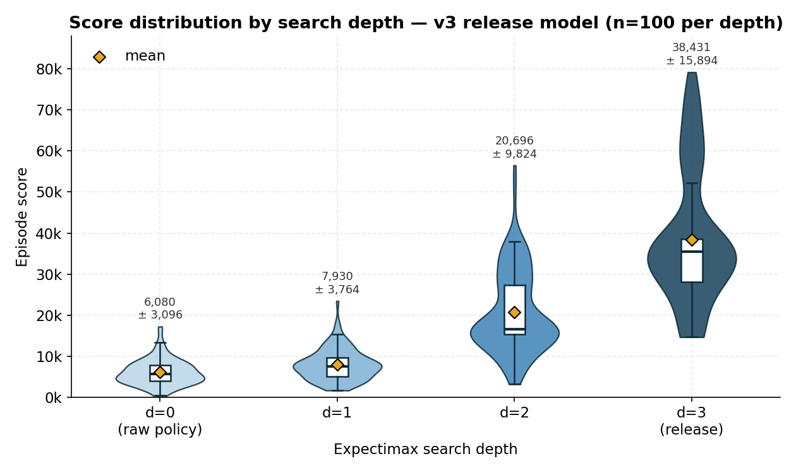
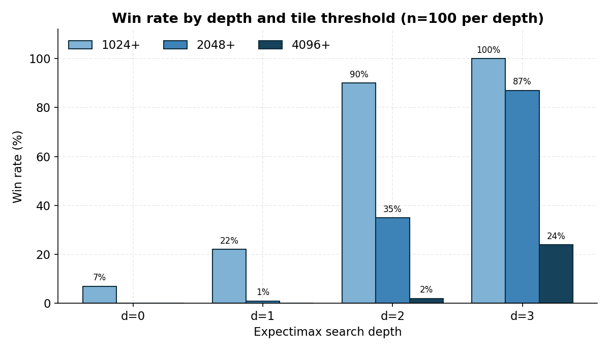
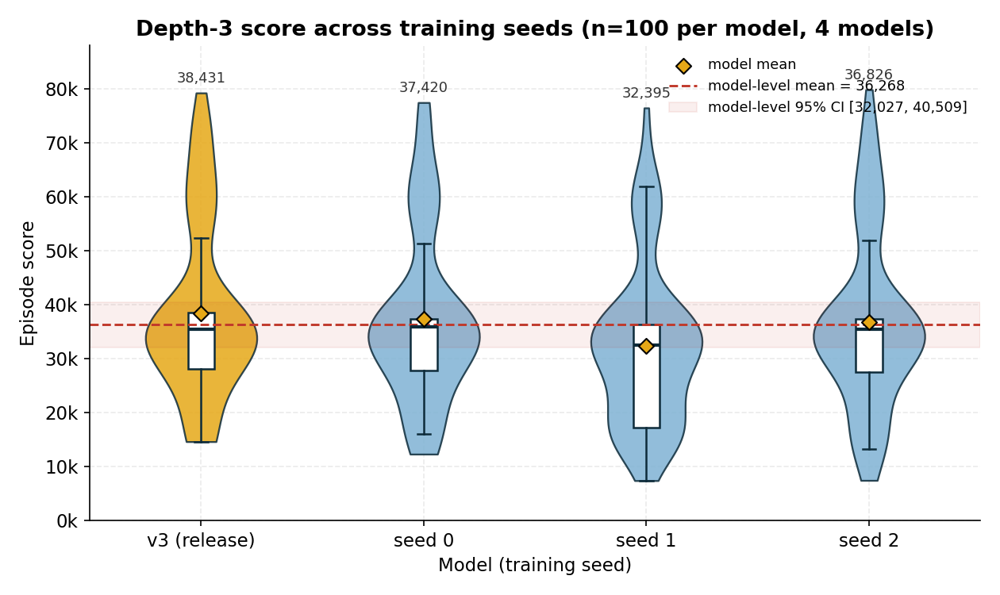

# **AI 2048: Hybrid RL + Expectimax Search**

**A Reproducible Research System Bridging Deep Reinforcement Learning and Classical Search**

[](https://www.python.org/downloads/) [](https://isocpp.org/) [](https://opensource.org/licenses/MIT)

---
## **Quick Links**
- [Demo](#demo) | [Benchmarks](#performance-results) | [Installation](#installation) | [CLI Docs](#command-line-interface) | [Seed Sweeps](#seed-sweep-training) | [Aggregation](#post-processing-aggregation)

## **Overview**

This project implements a **hybrid AI agent** for the game 2048 that combines:
1.  **Deep Reinforcement Learning** (Masked PPO) for learned value estimation.
2.  **Expectimax Search** (classical game tree search) for tactical planning.
3.  **Production-optimized C++ engine** achieving major speedup over Python implementations.

The core insight: **learned value functions can replace hand-crafted heuristics** in classical search algorithms, reducing search depth requirements while maintaining strong performance.

**Protocol status: PRE-FREEZE.** The v3 paper matrix is not complete. The
D4 seed0 200M run under `data/official_200m/` is a diagnostic pilot only and is
excluded from the final paper matrix; it must not be reported as an official
paper result.

**Historical diagnostic only (v3, D4-augmented, 100M-step dress rehearsal):**
the retained diagnostic model scored **38,430.76 ± 15,893.73** at depth 3
(n=100; 95% CI 35,316–41,546; median **35,508**), with win rates **100% / 87%
/ 24%** at 1024 / 2048 / 4096. The retained depth ablation used shared
per-episode tile-spawn seeds and is documented for reproducibility, not as
paper-grade evidence. None of these historical artifacts is part of the final
200M four-seed paper matrix. The files are archived under
`data/archive/v3-100m/` and are outside the default paper-grade discovery path.

### Current v3 protocol (PRE-FREEZE)

- **Representation:** boards use integer tile exponents `0..15`; `0` is empty,
  `1..15` represent powers of two through 32768, and exponents above `15` are
  rejected by the current native representation.
- **Reward:** invalid moves receive `-1.0`; valid moves combine `log2` merge
  reward, a `0.1` empty-cell bonus, and a `1e-4` maximum-over-D4 snake-gradient
  bonus. Expectimax chance values use the corrected divisor `N`, the number of
  empty cells, rather than `2N`.
- **RNG:** each environment owns a private NumPy generator; training derives
  reproducible D4 streams from the root seed; benchmark episodes receive
  deterministic per-episode evaluation seeds; and C++ chance nodes enumerate
  tile outcomes instead of sampling them.
- **Critic:** the value pathway uses non-affine normalization, and
  `ValueHeadLRMaskablePPO` applies the configured value-head learning-rate
  multiplier `10.0` while following the base schedule.
- **D4 evaluation:** `D4ValueEvaluator` expands each board across all eight D4
  orientations and returns their arithmetic mean. C++ canonicalization is a
  transposition-table/batch-deduplication optimization, not a single-value
  canonicalized critic protocol.

---

## **Demo**

<p align="center">
  <!-- Ensure assets/demo.gif exists or replace with a valid path -->
  
  <br/>
  <em>
    Agent demonstrating an emergent "Wall Strategy" (keeping max tile on edge center).
    <br/>
    Unlike the human "Snake" heuristic, the agent leverages Depth-3 Expectimax to maintain stability in this higher-entropy configuration.
  </em>
</p>

**Try it yourself:**
```bash
uv run python scripts/evaluate.py data/archive/v3-100m/models/release/Hybrid-PPO-Expectimax-v3.zip --depth 3
```

---

## **Performance Results**

### **Historical Diagnostic: Search-Depth Ablation (not a paper result)**

All rows are the **same historical v3 (D4-augmented) diagnostic model** (md5 `fab18d67…`), run with identical per-episode tile-spawn seeds (`--base-eval-seed 20482048`), `--device cuda --workers 1`, **n=100 episodes per depth**. Because the seed sequence is shared across depths, score deltas are attributable to search depth alone. These retained artifacts are not paper-grade evidence and are excluded from the target 200M four-seed matrix. The `paper_d*` folder names are historical artifact names only.

| Configuration | Avg Score | 95% CI | Median | 1024+ | 2048+ | 4096+ | Max Tile (top 3) |
|---|---:|---|---:|---:|---:|---:|---|
| Raw PPO Policy (d=0) | 6,080 ± 3,096 | 5,473–6,687 | 5,598 | 7% | 0% | 0% | 512 (46%), 256 (40%), 1024 (7%) |
| + Expectimax (d=1) | 7,930 ± 3,764 | 7,192–8,668 | 7,510 | 22% | 1% | 0% | 512 (54%), 1024 (21%), 256 (21%) |
| + Expectimax (d=2) | 20,696 ± 9,824 | 18,770–22,621 | 16,574 | 90% | 35% | 2% | 1024 (55%), 2048 (33%), 512 (9%) |
| **+ Expectimax (d=3)** | **38,431 ± 15,894** | **35,316–41,546** | **35,508** | **100%** | **87%** | **24%** | **2048 (63%), 4096 (24%), 1024 (13%)** |

**Historical v1→v3 context.** The pre-D4 v1 comparison is retained as a diagnostic explanation for why D4 augmentation was investigated. It is not a current acceptance criterion or paper result. In the current v3 pipeline, canonicalization is used for transposition-table keys and batch deduplication, while leaf evaluation uses the eight-way `D4ValueEvaluator` mean described below.

**To reproduce this historical diagnostic** (≈8.1 h on an RTX 3070 Ti Laptop GPU per depth):
```bash
uv run python -m scripts.benchmark data/archive/v3-100m/models/release/Hybrid-PPO-Expectimax-v3.zip \
  --n-runs 100 --depth 3 --device cuda --workers 1 \
  --output paper_d3_n100 --base-eval-seed 20482048
```
The ablation uses the same command with `--depth 0/1/2` and `--output paper_d{0,1,2}_n100`. All four runs share `--base-eval-seed 20482048`, so per-episode tile spawns are identical across depths.

**To verify D4 invariance of the released model** (≤30s on GPU):
```bash
uv run python scripts/diagnostics/check_d4_invariance.py
```

<p align="center">
  
  <br/><em>Historical/pre-freeze diagnostic: per-episode score by search depth (n=100 each, same tile-spawn seeds). Diamonds = mean. This is not a paper result.</em>
</p>

<p align="center">
  
  <br/><em>Historical/pre-freeze diagnostic: win-rate step change at depth 3. This is not a paper result.</em>
</p>


---

### **Historical Analysis: The Value Function as Heuristic**

The ablation study reveals how the learned value function behaves as a search heuristic. On the D4-augmented v3 model, score improves **monotonically with depth** — there is no shallow-search regression. Two regimes stand out:

#### **1. Depth 1→2: search starts to see merges**
A 1-ply lookahead only edges out the raw policy (7,930 vs 6,080, +30%) because one ply barely reaches the next merge. The large jump comes at depth 2 (20,696, +161% over d=1): two ply is enough to evaluate the board *after* a merge and the subsequent tile spawn, so the search rewards moves that open productive merges. Depth 2 is also the first depth where reaching 2048 becomes common (35% vs 1% at d=1).

#### **2. Depth 3: "search as regularization"**
Going to depth 3 aggregates value estimates over **~141M leaf nodes per game** (avg 9,532 CNN batch calls), which **filters noise** in $V(s)$ the way Monte-Carlo averaging does. Mean score reaches 38,431 (+86% over d=2) and the 2048+ win rate steps from 35% to 87%, with 24% of games reaching 4096. The search converges cleanly on every game (`moves_unresolved=0`, `cap_hits=0`).

**Connection to Bayesian Optimization:** This mirrors the exploration-exploitation trade-off in GP-UCB (Krause et al., 2009). Deeper search increases sample complexity but reduces epistemic uncertainty, similar to how UCB balances mean prediction with confidence bounds.

---

### **Historical Multi-Seed Diagnostic (depth 3; not a paper result)**

The historical diagnostic set contains four retained model artifacts (the release model plus training seeds 0/1/2). All four were benchmarked at depth 3, n=100 episodes each, with identical `--base-eval-seed 20482048` (archived run folders `seed{0,1,2}_d3_n100` + `paper_d3_n100`). It is a dress rehearsal, not the 200M four-seed paper matrix. The artifact contents remain unchanged for provenance.

| Model | Mean Score | 95% CI | Median | 2048+ | 4096+ |
|---|---:|---|---:|---:|---:|
| **v3 (release)** | **38,430.8 ± 15,894** | 35,316–41,546 | 35,508 | 87% | 24% |
| seed 0 | 37,420.2 ± 15,626 | 34,357–40,483 | 35,822 | 85% | 22% |
| seed 1 | 32,395.3 ± 14,648 | 29,524–35,266 | 32,526 | 72% | 16% |
| seed 2 | 36,826.0 ± 15,720 | 33,745–39,907 | 35,418 | 83% | 22% |

**Model-level statistics (n=4 seeds):** mean **36,268**, sample SD **2,665**, 95% CI **[32,027, 40,509]** (t-interval, df=3). Pooled across all 400 episodes: mean 36,268, median 34,834, p25/p75 = 27,416 / 37,053, range 7,424–79,808; win rates 1024+ **100%**, 2048+ **82%**, 4096+ **21%**. The best-to-lowest mean spread is 6,035 points (release vs seed 1); this four-run sweep quantifies seed sensitivity but is not a hypothesis test.

<p align="center">
  
  <br/><em>Historical/pre-freeze diagnostic: depth-3 score distribution per training seed (n=100 each). This is not a paper result.</em>
</p>

### **Historical Diagnostic Models and Benchmark Artifacts**

The repository retains the **four historical diagnostic models** and every benchmark artifact used by the figures and tables above. They are retained for reproducibility and provenance, not as paper evidence. They live under `data/archive/v3-100m/` so the current `data/benchmarks/` discovery path contains no legacy runs. Intermediate training checkpoints are intentionally omitted; the legacy 30-game `v3_depth3_final` preview is omitted because `paper_d3_n100` is the complete recorded 100-game diagnostic evaluation.

**Historical diagnostic models**

| Path | Contents |
|---|---|
| `data/archive/v3-100m/models/release/Hybrid-PPO-Expectimax-v3.zip` | Historical D4-augmented diagnostic model used for the depth-0 through depth-3 ablation. |
| `data/archive/v3-100m/models/hybrid_ppo_v3/sweep_status.json` | Historical completion manifest for the three-seed sweep. |
| `data/archive/v3-100m/models/hybrid_ppo_v3-seed0/final_model.zip` | Final model for training seed 0. |
| `data/archive/v3-100m/models/hybrid_ppo_v3-seed1/final_model.zip` | Final model for training seed 1. |
| `data/archive/v3-100m/models/hybrid_ppo_v3-seed2/final_model.zip` | Final model for training seed 2. |

**Benchmark artifacts** — every folder contains `config.json`, `summary.json`, and `episodes.csv`; the logged run also contains `moves.csv`.

| Folder | Evaluation |
|---|---|
| `data/archive/v3-100m/benchmarks/paper_d0_n100/` | Historical release model, raw policy (depth 0), n=100. |
| `data/archive/v3-100m/benchmarks/paper_d1_n100/` | Historical release model, depth 1, n=100. |
| `data/archive/v3-100m/benchmarks/paper_d2_n100/` | Historical release model, depth 2, n=100. |
| `data/archive/v3-100m/benchmarks/paper_d3_n100/` | Historical release model, depth 3, n=100. |
| `data/archive/v3-100m/benchmarks/paper_d3_n100_logged/` | Historical/corrupt depth-3 per-move log; compound keys are non-unique and it is not row-level evidence. |
| `data/archive/v3-100m/benchmarks/seed0_d3_n100/` | Historical seed-0 model, depth 3, n=100. |
| `data/archive/v3-100m/benchmarks/seed1_d3_n100/` | Historical seed-1 model, depth 3, n=100. |
| `data/archive/v3-100m/benchmarks/seed2_d3_n100/` | Historical seed-2 model, depth 3, n=100. |

---

## **Technical Architecture**

### **System Design Philosophy**

The project follows a **two-stage pipeline** optimized for both training efficiency and inference performance:

```text
┌─────────────────────────────────────────────────────────────┐
│                       TRAINING PHASE                        │
│ ┌──────────────┐          ┌────────────────────────────┐    │
│ │Python Engine │ ──────>  │   Masked PPO (Stable-SB3)  │    │
│ │ (Numba/JIT)  │          │     - Value Net V(s)       │    │
│ │  - LUT Moves │          │     - Policy Net π(s|a)    │    │
│ │              │          │ - Optuna Hyperparameter Opt│    │
│ └──────────────┘          └────────────────────────────┘    │
└─────────────────────────────────────────────────────────────┘
                                   │
                      Checkpoint: final_model.zip
                                   ▼
┌─────────────────────────────────────────────────────────────┐
│                      INFERENCE PHASE                        │
│ ┌──────────────┐          ┌────────────────────────────┐    │
│ │  C++ Engine  │ ──────>  │    Expectimax Searcher     │    │
│ │              │          │   - Batch Leaf Evaluation  │    │
│ │              │ <──────  │ - Transposition Table Cache│    │
│ │              │   V(s)   │   - Chance Node Averaging  │    │
│ └──────────────┘          └────────────────────────────┘    │
└─────────────────────────────────────────────────────────────┘
```

---

### **1. High-Performance C++ Core**

#### **Lookup Table (LUT) Move System**

Instead of simulating tile movements with nested loops, all **65,536 possible row configurations** are precomputed at initialization:

```cpp
// Fast2048.cpp - O(1) move execution
void Fast2048::move(int direction) {
    for (auto &row : board) {
        int index = row_to_number(row); // Pack 4 tiles into 16-bit int
        merge_score += move_reward_LUT[index];
        row = move_row_LUT[index];      // ← O(1) table lookup
    }
}
```

**Technical Details:**
- **Row Encoding:** `index = tile[0] | (tile[1] << 4) | (tile[2] << 8) | (tile[3] << 12)`
- **LUT Size:** 3 tables × 65,536 entries = **~800KB memory**
- **Precomputation:** Happens once at startup via `init_LUT()`

This optimization is critical for Expectimax search, which evaluates **10,000+ board states per move** at depth 3.

---

#### **Expectimax with a Persistent Transposition Table**

Leaf evaluation is memoized in a **persistent transposition table** that survives across `find_best_move` calls within an episode (only `clear_tt()` wipes it). It is factored into its own header, [`TranspositionTable.h`](cpp_src/TranspositionTable.h), and is a **4-way set-associative** cache sized to fit a 64-byte cache line:

```cpp
// TranspositionTable.h — 16-byte entries, 4-way associative buckets
struct TTEntry {
    uint64_t key;        // canonical (D4) packed board — NOT a Zobrist hash
    float    score;      // expectimax value
    uint8_t  depth;      // search depth remaining (depth-preferred replacement)
    uint8_t  type;       // MAX | CHANCE
    uint8_t  generation; // 5-bit age tag, used for cross-search eviction
};
struct TTBucket { TTEntry entries[4]; };          // 64 bytes → one cache line
// 2^22 buckets × 4 entries = 2^24 entries ≈ 256 MiB
```

Probing is **depth-preferred** (a hit only counts when the stored depth ≥ requested). The store path uses a three-tier replacement policy: (1) overwrite the same key, (2) fill an empty slot, (3) two-pass victim selection that first prefers the oldest **generation** (cross-search eviction), then falls back to the shallowest depth within the current search. `begin_new_search()` advances the generation each move so stale entries age out naturally.

The search itself is a **per-move, multi-pass, deferred-batching** loop (`ExpectimaxSearcher::find_best_move`). Each root move is resolved independently with a hard iteration cap (`MAX_ITERATIONS_PER_MOVE = 100`) that failsafes against any re-evaluation loop:

```cpp
// ExpectimaxSearcher.cpp — one root move's resolution loop
while (std::isinf(move_scores[rm.move_id])) {
    if (++iter > MAX_ITERATIONS_PER_MOVE) { cap_hits_this_call++; break; }
    batch_queue.clear();
    float v = chance_node_substitute(rm.post_board, depth,
                                     BoardEncoder::canonicalize(rm.post_board),
                                     batch_queue);
    if (!std::isinf(v)) { move_scores[rm.move_id] = v; break; }   // resolved this pass
    // otherwise: leaves parked in batch_queue → eval in Python, store at depth 0, re-search
    std::sort(batch_queue.begin(), batch_queue.end());             // dedup canonical keys
    batch_queue.erase(std::unique(batch_queue.begin(), batch_queue.end()),
                      batch_queue.end());
    auto values = batch_eval_func(boards_for_python);              // ONE Python call / pass
    for (size_t i = 0; i < batch_queue.size(); ++i) {
        transposition_table.store(batch_queue[i], /*depth*/0, NodeType::MAX,    values[i]);
        transposition_table.store(batch_queue[i], /*depth*/0, NodeType::CHANCE, values[i]);
    }
}
```

On top of TT memoization, the current searcher adds:

- **Root move ordering via CNN pre-evaluation.** Before searching, the four root post-move boards are batch-evaluated by the value net and sorted best-first, prioritizing promising moves.
- **Corrected chance-node divisor.** `E[V] = (1/N)·Σ_c (0.9·V(c,2) + 0.1·V(c,4))` over the N empty cells — the earlier `2N` divisor half-scaled the chance value and biased the search.
- **Log2 immediate-merge reward** folded into node values.
- **Batch deduplication** (canonical keys are `sort`+`unique`'d before the Python call) and a hard iteration cap that converts any pathological re-eval into a logged warning instead of a hang.

##### Transposition Table Efficacy (n=100, depth 3)

- **TT hit rate:** **20.34%** at depth 3, rising over each episode as the persistent TT warms up. It is higher at shallower depths (46.7% at d=1, 33.9% at d=2) because smaller trees reuse a larger share of nodes. The key is the **canonical D4 form** of the board, so rotated/reflected boards share entries.
- **Throughput:** depth-3 search averages **~141M nodes visited per game** across ~6,907 resolved root moves, at **485,708 nodes/sec**, in ~9,532 CNN batches/game (~291 s/game on an RTX 3070 Ti Laptop GPU).
- **Convergence:** every game resolves cleanly — `moves_unresolved = 0`, `cap_hits = 0`.

---

#### **Batched Leaf Evaluation (Deferred Batching)**

The multi-pass scheme above means Python is called **once per pass** with the full deduplicated batch of unresolved canonical leaves (`target_batch_size` default **32,768**), instead of once per leaf. The C++ canonicalizes each board to one D4 element before keying the batch, then `BoardEncoder::unpack`s it back to a raw 4×4 board for the model. In the current v3 pipeline, the Python callback is `D4ValueEvaluator`: it expands each board to all eight D4 orientations and averages the resulting values. Canonical keys therefore optimize TT and batch reuse; they do not define a single-orientation critic evaluation.

Per-game batch counts and throughput scale steeply with depth (all n=100, same seeds):

| Depth | Avg batches/game | Avg nodes/game | Avg nodes/sec | TT hit rate | Avg time/game |
|---|---:|---:|---:|---:|---:|
| 1 | 2,347 | 45,129 | 21,139 | 46.7% | 2.4 s |
| 2 | 5,183 | 3,077,630 | 231,161 | 33.9% | 14.0 s |
| 3 | 9,532 | 140,691,277 | 485,708 | 20.3% | 291.4 s |

On GPU, batched evaluation amortizes Python-interpreter and CUDA-kernel-launch overhead across thousands of states, keeping per-leaf inference latency low even at depth 3.

---

### **2. Masked PPO Training**

#### **Invalid Action Masking**

Standard PPO wastes samples exploring invalid moves (e.g., moving left when tiles are already left-aligned). We use **action masking** to constrain the policy:

```python
# environment.py - Dynamic action masks
def action_masks(self) -> np.ndarray:
    canonical = np.array(
        [self.game.is_move_valid(act) for act in range(4)], dtype=bool
    )
    return transform_action_mask(canonical, self._current_d4)
```

The `transform_action_mask` call is the D4-augmentation hook: when training
with `d4_augment=True`, the env presents the board under a random D4
symmetry and the action mask is permuted to match. See "D4 Augmentation"
below.

---

#### **Reward Shaping: Merge + Free Cells + Snake Gradient**

The reward function in [`reward.py`](twenty_forty_eight_ai/env/reward.py) (Numba `@njit`) combines three terms. The board is stored as tile exponents (`0..15`), and the gradient term is invariant to all eight D4 symmetries. This is the corrected reward used by the current v3 environment; the C++ chance-node expectation separately uses the corrected `N` empty-cell divisor.

```python
# reward.py — reward = log-merge + free-cells bonus + snake-gradient bonus
MERGE_REWARD_COEF = 1.0
FREE_CELLS_COEF   = 0.1
GRADIENT_COEF     = 1e-4
ROW_GRADIENT      = np.arange(16, dtype=np.float32).reshape(4, 4)   # snake along a row
COL_GRADIENT      = ROW_GRADIENT.T                                   # snake along a column
D4_GRADIENTS      = the 8 D4 transforms of ROW_GRADIENT

@njit
def calculate_reward(board, merge_score, moved):
    if not moved:
        return -1.0
    merge_reward      = np.log2(merge_score) if merge_score > 0 else 0.0
    free_cells_reward = np.sum(board == 0)
    gradient_reward   = max(np.sum(board * gradient)
                            for gradient in D4_GRADIENTS)
    return (MERGE_REWARD_COEF * merge_reward
            + FREE_CELLS_COEF  * free_cells_reward
            + GRADIENT_COEF    * gradient_reward)
```

**Why this works:**
- **Log merge score:** reduces variance as tile values grow exponentially.
- **Free-cells bonus:** discourages filling the board (more empty cells = more moves available).
- **Snake gradient:** soft prior toward keeping the max tile in a corner with descending values along a row/column, evaluated directly on the board exponents and maximized over all D4 orientations.

---

#### **Custom Neural Network Architecture**

The feature extractor ([`architecture.py`](twenty_forty_eight_ai/agent/architecture.py)) is a 2048-aware CNN. Each operational tile is an **integer log2 index (0–15)** fed into a learned **`nn.Embedding(17, 128)`** (the extra slot remains for frozen-checkpoint compatibility; it is not part of the operational board contract); the embedded 128-channel 4×4 grid then passes through three **depthwise-separable** conv pathways that look for row, column, and 2×2-block patterns, before being concatenated and projected to `features_dim = 256`:

```text
Input: board (int64 log2 tile indices, 0=empty … 15=32768)   shape (1, 4, 4)
       │  nn.Embedding(num_embeddings=17, embedding_dim=128)
       ▼
128-channel 4×4 grid                                    shape (128, 4, 4)
       │
       ├─> DepthwiseSeparableConv(128→128, kernel=1×4) ──> Row patterns      (e.g. [2,2,4,8])
       ├─> DepthwiseSeparableConv(128→128, kernel=4×1) ──> Column patterns
       └─> DepthwiseSeparableConv(128→128, kernel=2×2) ──> 2×2 block patterns
              │  each: ReLU → Flatten
              ▼
       Concatenate ──> Linear(→ 256) ──> ReLU ──> {Policy head, Value head}
```

`DepthwiseSeparableConv` splits each stage into a depthwise conv (one filter per input channel) followed by a 1×1 pointwise conv, cutting parameters versus a dense `Conv2d` while preserving the spatial-pattern decomposition.

**Why a custom CNN over an MLP?**
- 2048 exhibits **structural patterns** (e.g., a `[2,4,8,16]` row matters regardless of where it sits); the row/column/block pathways encode these directly.
- **Learned tile embeddings** represent the huge dynamic range of operational tile values (2 … 32768) without log-normalization hacks, and depthwise-separable convs share weights across positions, improving sample efficiency.

---

### **3. PRE-FREEZE v3 Hyperparameter Screening**

The official Stage 1 tuner is a paired **Optuna** study logged to Weights &
Biases. Each trial samples one PPO configuration and evaluates it from scratch
under both D4 and No-D4. The shared training seed, budget, evaluation seeds,
architecture, corrected reward, and evaluator are identical; only
`env_kwargs.d4_augment` changes. The objective uses the symmetric mean of
`log1p(depth1_mean_score)` for the two conditions, never training reward.

The checked-in config defines 12 trials, 20M timesteps per condition, and
reproducible evaluations at 5M, 10M, and 20M. The six search parameters are
`learning_rate`, `gamma`, `gae_lambda`, `ent_coef`, `vf_coef`, and
`clip_range`; `n_steps=512`, batch size `4096`, four epochs, 128 environments,
the normalized v3 critic, and the value-head LR multiplier `10.0` remain fixed.

```bash
uv run python scripts/tune.py \
  --config configs/tune/bayesian_opt_search.yaml --dry-run
uv run python scripts/tune.py \
  --config configs/tune/bayesian_opt_search.yaml
```

Tuning artifacts are stored under `data/tuning/v3/<study>/`, are ignored by
Git, and are explicitly `PRE-FREEZE`/`paper_grade: false`. They must not be
treated as the official 200M matrix or paper results. The dry-run validates the
official v3 base configs and creates no study, W&B run, model, or training
artifact.

**Target v3 Training Hyperparameters (PRE-FREEZE; [`configs/train/hybrid_ppo_v3.yaml`](configs/train/hybrid_ppo_v3.yaml)):**
- Learning Rate: `2.507e-4` (linear decay to 0)
- Discount Factor ($\gamma$): `0.9500`
- GAE Lambda ($\lambda$): `0.95` (Stable-Baselines3 default; not overridden in config)
- Entropy Coefficient: `6.684e-6`
- Value Function Coefficient: `0.5` (Stable-Baselines3 default)
- Clip Range ($\epsilon$): `0.2`
- Rollout steps per env (`n_steps`): `512`
- Batch Size: `4096`
- Epochs per update: `4`
- Total timesteps: `200,000,000`
- Parallel envs: `128`
- Value-head LR multiplier: `10.0` (fixed v3 critic optimization)

---

## **Research Connections**

### Relation to Bayesian Optimization (GP-UCB, Srinivas et al. 2009)

Tuning the PPO hyperparameters for this agent is an instance of **black-box optimization**:
- Input: one shared hyperparameter vector \(x\), evaluated in D4 and No-D4
- Output: noisy symmetric objective from fixed-seed depth-1 evaluation

I use **Optuna’s optimization and pruning workflow** to choose hyperparameters,
which is conceptually close to the **GP-UCB** framework: a study records noisy
trial outcomes and an acquisition rule balances exploration (trying uncertain
regions) and exploitation (refining promising ones). The v3 runner reports
only after reproducible checkpoint evaluations and keeps invalid runs separate
from ordinary pruning.
### Conceptual Parallel: Planning Under Uncertainty

Although Expectimax in this project does **not** implement Gaussian-process UCB, it faces a related trade-off: 
- The value function \(V(s)\) acts as a learned surrogate for long-term return.
- Expectimax search over stochastic tile spawns reduces uncertainty by averaging over possible futures.

This is philosophically similar to Bayesian optimization’s use of surrogate models and uncertainty-aware acquisition, but without explicit confidence bounds or regret guarantees.

---

## **Command-Line Interface**

All scripts support the `--help` flag for detailed usage information. Below are common workflows:

### **Training**

Train a new agent from scratch or resume from a checkpoint:

```bash
uv run python scripts/train.py --config <path_to_yaml>
```

**Required Config Keys (YAML):**

```yaml
project_name: "2048-ppo-training" # W&B project name
run_name: "hybrid_ppo_v3" # Unique run identifier
output_dir: "data/pre_freeze_200m" # Target output directory; pilot is separate
total_timesteps: 200_000_000 # Total training steps
n_envs: 128 # Parallel environments
save_interval: 5_000_000 # Checkpoint frequency (steps)
seed: 0 # Root seed for PPO, gameplay streams, and D4 rank derivation
features_dim: 256 # CNN feature extractor output size

# PPO Hyperparameters
ppo_params:
  learning_rate:
    type: "linear_decay"
    initial_value: 0.0002506795165161916
  gamma: 0.9500241783796721 # Discount factor
  gae_lambda: 0.95 # GAE parameter
  clip_range: 0.2 # PPO clip range
  ent_coef: 0.000006683561172757891 # Entropy coefficient
  n_steps: 512
  batch_size: 4096
  n_epochs: 4

# Resume Training (optional; omit both keys for fresh training)
load_model: false # Set to true to resume
checkpoint_path: null # Required when load_model is true
```

`load_model` defaults to `false` and `checkpoint_path` defaults to `null` when omitted. Setting `load_model: true` without a non-empty checkpoint path raises a configuration error before loading.

The current v3 configs write new training outputs under
`data/pre_freeze_200m/`. The existing D4 seed0 200M diagnostic pilot remains
under `data/official_200m/` and is not reused by the target workflow.

**Example:**

Fresh training
```bash
uv run python scripts/train.py --config configs/train/hybrid_ppo_v3.yaml
```

Resume from checkpoint
```bash
uv run python scripts/train.py --config configs/archive/resume_training.yaml
```

**Seed Sweep Training:**

Run multiple seeds sequentially for statistical robustness:
```bash
# Dry run to preview the intended four-seed v3 sweep
uv run python scripts/train.py --config configs/train/hybrid_ppo_v3.yaml \
  --seed-sweep 4 --dry-run

# Launch the intended four-seed v3 sweep (sequential)
uv run python scripts/train.py --config configs/train/hybrid_ppo_v3.yaml \
  --seed-sweep 4

# v3 target sweeps must start from scratch; --resume-sweep is rejected for v3.
```

**Arguments:**
- `--seed <int>`: Set a single fixed seed
- `--seed-sweep <N>`: Launch N sequential runs with seeds 0..N-1
- `--resume-sweep`: Resume non-v3 diagnostic/legacy sweeps; rejected for v3
- `--dry-run`: Print sweep plan without launching any jobs

**Output Structure:**
```
data/pre_freeze_200m/models/<run_name>/sweep_status.json        # Tracks seed status
data/pre_freeze_200m/models/<run_name>-seed0/final_model.zip
data/pre_freeze_200m/models/<run_name>-seed1/final_model.zip
data/pre_freeze_200m/models/<run_name>-seed2/final_model.zip
data/pre_freeze_200m/models/<run_name>-seed3/final_model.zip
```

Each seed run's W&B run name is `<run_name>-seed<N>` for easy filtering.

---

### **Hyperparameter Tuning**

Run the official paired v3 Stage 1 screening study (PRE-FREEZE):

```bash
uv run python scripts/tune.py \
  --config configs/tune/bayesian_opt_search.yaml --dry-run
uv run python scripts/tune.py \
  --config configs/tune/bayesian_opt_search.yaml
```

The checked-in YAML is the source of truth for the study contract: 12 trials,
training seed `0`, 20M timesteps per condition, checkpoints at 5M/10M/20M,
eight fixed evaluation seeds, `TPESampler(seed=20482048)`, and
`MedianPruner` with five startup trials. It searches only the six documented
PPO values and keeps the v3 policy, normalized critic, reward, evaluator,
architecture, and value-head multiplier `10.0` fixed.

Each trial creates one shared parameter set and two condition namespaces under
`data/tuning/v3/<study>/trial_<N>/{d4,no_d4}/`. The SQLite study and immutable
configuration hash are stored under `data/tuning/v3/<study>/`; all of these
generated artifacts are ignored by Git. Resume with a changed search space,
seed, budget, pruner, base-config hash, commit, or native-extension hash is
rejected. A W&B run is created per condition and linked from the trial
manifest.

---

### **Evaluation (Visual Dashboard)**

Watch the agent play in an interactive **pygame + pygame_gui dashboard** (`scripts/evaluate.py` → [`twenty_forty_eight_ai/utils/visualizer.py`](twenty_forty_eight_ai/utils/visualizer.py)). The dashboard renders the board alongside a live stats panel and **three sparkline charts** (score, per-move think-time, nodes visited), four action-value progress bars, a scrolling move-history list, and runs the expectimax search on a **background thread** (event-driven via `threading.Event` + a result queue) so the UI never blocks. **New Game** and **Pause** buttons are wired up.

```bash
uv run python scripts/evaluate.py <model_path> [OPTIONS]
```

**Arguments:**
- `model_path` (required): Path to trained model `.zip` file
- `--no-search`: Disable Expectimax search (use raw PPO policy)
- `--depth <int>`: Search depth for Expectimax (default: 3)
- `--no-stats`: Hide the enhanced stats panel + sparklines for faster rendering

**Examples:**

Depth-3 Expectimax (recommended)
```bash
uv run python scripts/evaluate.py data/archive/v3-100m/models/release/Hybrid-PPO-Expectimax-v3.zip --depth 3
```

Raw policy (no search)
```bash
uv run python scripts/evaluate.py data/archive/v3-100m/models/release/Hybrid-PPO-Expectimax-v3.zip --no-search
```

Shallow search (faster, worse performance)
```bash
uv run python scripts/evaluate.py data/archive/v3-100m/models/release/Hybrid-PPO-Expectimax-v3.zip --depth 1
```

---

### **Benchmark Harness**

Run reproducible benchmark evaluations without visualization. The harness emits structured CSV + JSON suitable for downstream analysis (`aggregate.py`, pandas, and figures). `--paper-mode` is reserved for a complete, provenance-bound target matrix; the current protocol remains PRE-FREEZE.

**Invocation:**

```bash
uv run python -m scripts.benchmark <model_path> [OPTIONS]
```

Both module and direct-script forms are supported. The direct script adds the repository root to `sys.path` before importing sibling modules:

```bash
uv run python -m scripts.benchmark <model_path> [OPTIONS]
uv run python scripts/benchmark.py <model_path> [OPTIONS]
```

**Arguments:**

| Flag | Type | Default | Description |
|---|---|---|---|
| `model_path` | str | required | Path to trained model `.zip` |
| `--n-runs` | int | `100` | Number of episodes |
| `--depth` | int | `0` | Expectimax search depth; `0` = raw policy |
| `--output` | str | `run_<timestamp>` | Folder name under `data/benchmarks/` |
| `--sweep-name` | str | output name | Manifest metadata used for aggregation selection |
| `--device` | `{cpu,cuda,auto}` | `auto` | Inference device |
| `--workers` | int | `1` | Number of subprocess workers |
| `--log-moves` | flag | off | Write `moves.csv` with one row per player move |
| `--yes-large-move-log` | flag | off | Required if estimated move-log rows > 5M |
| `--base-eval-seed` | int | random | Root seed for deterministic per-episode eval seeds |
| `--train-seed` | int | none | Recorded in `config.json` for sweep runs |
| `--model-version` | str | none | Free-form version label, recorded in `config.json` |
| `--paper-mode` | flag | off | Require clean, complete, provenance-bound paper-grade output |
| `--allow-dirty-paper-run` | flag | off | Allow a dirty tree, marking output non-paper-grade |
| `--effective-config` | path | model-adjacent file | Resolved training config used for paper provenance |
| `--training-manifest` | path | model-adjacent file | `training_manifest.json` bound to the model |

**Quick examples:**

```bash
# Historical diagnostic benchmark; this 100M model is not paper-grade.
uv run python -m scripts.benchmark \
  data/archive/v3-100m/models/release/Hybrid-PPO-Expectimax-v3.zip \
  --n-runs 100 --depth 3 --workers 1 --device cuda \
  --output v3_depth3_diagnostic --base-eval-seed 0

# Intended paper-grade example after the complete 200M matrix is available.
# The model directory must contain its matching effective_config.json and manifest.
# Do not use --paper-mode with the existing data/official_200m/ pilot: it is diagnostic only.
uv run python -m scripts.benchmark \
  data/pre_freeze_200m/models/hybrid_ppo_v3-seed0/final_model.zip \
  --n-runs 100 --depth 3 --workers 1 --device cuda \
  --output v3_pre_freeze_seed0_depth3 --base-eval-seed 20482048 \
  --train-seed 0 --sweep-name hybrid_ppo_v3_pre_freeze --paper-mode

# Throughput-mode: 8 CPU workers, depth-3
uv run python -m scripts.benchmark \
  data/archive/v3-100m/models/release/Hybrid-PPO-Expectimax-v3.zip \
  --n-runs 200 --depth 3 --workers 8 --device cpu \
  --output v3_depth3_throughput --base-eval-seed 0

Throughput runs may omit training metadata and still execute, but they are not
eligible for manifest-driven aggregation without a resolved effective config,
condition, and training seed. Use `--effective-config`, `--train-seed`, and
`--sweep-name` when the run is intended for aggregation.

# Raw-policy baseline (no search)
uv run python -m scripts.benchmark \
  data/archive/v3-100m/models/release/Hybrid-PPO-Expectimax-v3.zip \
  --n-runs 100 --depth 0 --workers 1 \
  --output v3_raw --base-eval-seed 0

# Per-move log for downstream analysis
uv run python -m scripts.benchmark \
  data/archive/v3-100m/models/release/Hybrid-PPO-Expectimax-v3.zip \
  --n-runs 50 --depth 3 --workers 1 \
  --log-moves --output v3_depth3_moves
```

**Operational recommendations:**

| Goal | Recommended |
|---|---|
| Target-matrix single-GPU latency, reproducible | `--device cuda --workers 1` |
| Experimental: parallel GPU inference | `--device cuda --workers 2` (only if GPU memory fits two model copies) |
| Maximum throughput on a CPU box | `--device cpu --workers 4-8` |

#### Output Structure

Every run produces three required files in `data/benchmarks/<run_name>/`, plus `moves.csv` when `--log-moves` is enabled:

```
data/benchmarks/<run_name>/
├── config.json    # Run provenance + config (written at start, updated at end)
├── episodes.csv   # One row per completed episode
├── moves.csv      # One row per player move (optional, --log-moves)
└── summary.json   # Aggregate metrics + status
```

The harness writes `episodes.csv` and `moves.csv` incrementally with `flush()` after each row. A `kill -9` may leave usable partial CSV output and the initial `config.json`, but the master cannot update that config after SIGKILL; its status can remain `"running"`. Use Ctrl-C (SIGINT) or SIGTERM for a clean interrupted summary.

#### `config.json` schema

```json
{
  "benchmark_schema_version": "2.1.0",
  "run_id": "uuid4...",
  "run_name": "v3_pre_freeze_seed0_depth3",
  "sweep_name": "hybrid_ppo_v3_pre_freeze",
  "model_path": "/repo/data/pre_freeze_200m/models/hybrid_ppo_v3-seed0/final_model.zip",
  "training_manifest_path": ".../training_manifest.json",
  "training_manifest_sha256": "...",
  "training_model_sha256": "...",
  "training_seed": 0,
  "condition": "d4",
  "d4_augment": true,
  "policy_class": "...ValueNormalizedMaskablePolicy",
  "ppo_class": "...ValueHeadLRMaskablePPO",
  "value_head_lr_multiplier": 10.0,
  "final_timestep": 200000000,
  "training_git_commit": "...",
  "model_md5": "fab18d67...",
  "model_version": "v3",
  "train_seed": 0,
  "env_seed_base": 12345,
  "n_runs": 100,
  "n_workers": 4,
  "device": "cuda",
  "cuda_device_name": "NVIDIA GeForce RTX 3070 Ti Laptop GPU",
  "cuda_runtime": "13.0",
  "depth": 3,
  "use_expectimax": true,
  "log_moves": false,
  "base_eval_seed": 12345,
  "eval_seed_strategy": "deterministic-offset",
  "git_commit": "abc1234",
  "git_dirty": false,
  "started_at_iso": "2026-06-27T12:34:56Z",
  "finished_at_iso": "2026-06-27T12:41:48Z",
  "total_wall_time_s": 412.7,
  "interrupted": false,
  "status": "completed",
  "outcome_fingerprint": "..."
}
```

Field semantics:

- `benchmark_schema_version`: semver. The manifest-driven loader accepts exactly `2.1.0`; older or future versions are not silently migrated.
- `env_seed_base`: root used to derive each episode's `eval_seed`; the episode
  passes that seed to `Game2048Env.reset()`, which owns the private tile RNG.
- `eval_seed_strategy`: `"deterministic-offset"` (master assigns `eval_seed = env_seed_base + episode_idx`) or `"random"` (when `base_eval_seed` is unset).
- `total_wall_time_s`: full run wall-clock (includes worker spawn + summary write).
- `status`: `"completed"` | `"interrupted"` | `"failed"`.
- `interrupted`: `true` only when the master handles `SIGINT`/`SIGTERM`.
- `training_manifest_path` is the immutable manifest produced beside the model. Paper-grade validation rehashes the manifest, model, effective config, native extension, and `uv.lock`, then checks the model class, training seed, D4 condition, multiplier, final timestep, and training commit against it.
- `condition`, `training_seed`, and `depth` form the experimental identity. CLI `--train-seed` is checked against the manifest; it is not the source of truth.
- `outcome_fingerprint` is a deterministic SHA-256 over stable per-episode outcomes. Timing, worker identity, run ID, and move logging are excluded so logged/unlogged twins can be detected without counting them as extra replicates.

#### `episodes.csv` columns (42 fields)

The column list lives in `scripts/benchmark_io.py:EPISODE_COLUMNS` — single source of truth for both the writer (`benchmark.py`) and the consumer (`aggregate.py`). Adding a column means updating that list AND the `EpisodeResult` dataclass together.

Per-episode fields:

| Field | Notes |
|---|---|
| `schema_version`, `run_id`, `episode_idx`, `worker_id` | Identifiers |
| `train_seed`, `eval_seed` | Seeds (reproducibility) |
| `requested_depth`, `effective_depth`, `use_expectimax` | Search config (forward-compat: `effective_depth` will diverge from `requested_depth` if iterative deepening lands) |
| `score`, `max_tile`, `max_log_tile`, `steps` | Outcome |
| `episode_time_s`, `mean_move_time_ms`, `median_move_time_ms`, `p95_move_time_ms`, `max_move_time_ms` | Wall time |
| `termination_reason` | `"board_full"` (today) or `"max_steps"` (reserved) |
| `win_1024`, `win_2048`, `win_4096`, `win_8192` | Boolean thresholds |
| `total_think_ms`, `total_nodes`, `total_batches` | C++ search think-time aggregates |
| `total_tt_lookups`, `total_tt_hits`, `total_tt_collisions`, `total_tt_same_key_overwrites` | Transposition table |
| `total_moves_resolved`, `total_moves_unresolved`, `total_cap_hits` | Resolution + iteration-cap hits |
| `total_chance_nodes`, `total_max_nodes` | Search node-type counts |
| `mean_chance_value` | Average chance-node value |
| `mean_empty_cells`, `min_empty_cells`, `mean_merge_score` | Board-state distributions |
| `mean_nps`, `mean_tt_hit_rate`, `mean_nodes_per_batch_call` | Derived rates |

#### `moves.csv` columns (29 fields)

Opt-in via `--log-moves`. One row per player move. Useful for paper figures on board evolution, tile-spawn distributions, and search-time histograms. **Can produce GB-scale files** — use `--log-moves` only when you need per-move data.

All board-snapshot fields (`board_state`, `canonical_board_hash`, `empty_cells_before`, `max_tile_before`, `max_log_tile_before`, `n_legal_actions`, `score_*`) come from the **same pre-action board snapshot**. The row describes the decision point, not the post-decision state.

| Notable field | Notes |
|---|---|
| `board_state` | 16 comma-separated log-tile values in row-major order; `0`=empty, `11`=2048-tile; frozen C++ search rejects exponents above `15` |
| `canonical_board_hash` | `BoardEncoder::canonicalize` uint64 (D4-canonical form), base-10 string |
| `score_up/right/down/left` | C++ root-move scores (or `NaN` in raw-policy mode) |
| `move_time_ms` | Wall-time around the full move (search + env step) |
| `think_ms` | Just the C++ `find_best_move` time |

**Metric semantics:**

- `total_nodes` is the sum of `nodes_visited`: every MAX/CHANCE traversal, including re-traversals and traversals that return from the TT; it is not a unique-state count.
- `total_batches` is the sum of `batches_eval`: exact calls to the Python batch evaluator, including root pre-evaluation and deferred leaf batches.
- `total_tt_lookups` counts probes; `total_tt_hits` counts exact key/depth/type matches; `mean_tt_hit_rate` is the per-episode `total_tt_hits / total_tt_lookups` rate.
- `total_tt_collisions` counts insertions into full four-way buckets that replace an entry. It is not a hash-collision proof. `total_tt_same_key_overwrites` counts replacement of an existing identical key/depth/type entry.
- `total_chance_nodes` and `total_max_nodes` count node-function entries, including TT hits. `mean_chance_value` is based only on newly computed, fully resolved chance-node returns; cached TT returns are excluded.
- `merge_score` in `moves.csv` is the exact merge score reported by the environment for each move. `mean_merge_score` in `episodes.csv` is the arithmetic mean of those per-move values.
- Missing required telemetry is an error; it is never replaced with a zero default.

`--log-moves` writes a single warning + estimated row count and disk usage before any worker spawns. The estimate uses a fixed 500-step-per-episode heuristic, so it can underestimate long depth-3 episodes. If the estimate exceeds 5,000,000 rows, the run refuses to start unless `--yes-large-move-log` is passed.

#### `summary.json`

Aggregate metrics for quick inspection. Mirrors the shape of the old `results.json["metrics"]` block plus the new search-mode fields, win-rate thresholds (1024/2048/4096/8192), and a max-tile distribution.

```json
{
  "benchmark_schema_version": "2.1.0",
  "status": "completed",
  "n_completed": 100,
  "n_runs_requested": 100,
  "config": { "...subset of config.json...": "..." },
  "metrics": {
    "avg_score": 24320.5, "std_score": 8921.3, "min_score": 8400, "max_score": 51200,
    "median_score": 23456, "p25_score": 18432, "p75_score": 31204,
    "avg_steps": 487.2, "min_steps": 312, "max_steps": 901, "median_steps": 478,
    "total_time_s": 410.2, "total_wall_time_s": 412.7,
    "avg_time_per_game_s": 4.10, "games_per_sec": 0.244,
    "avg_think_ms": 38.7, "avg_nodes_visited": 1124.5, "avg_batches_eval": 3.2,
    "avg_nodes_per_sec": 29040.0, "avg_tt_hit_rate": 12.4,
    "avg_tt_collisions": 0.8, "avg_tt_same_key_overwrites": 0.1,
    "avg_moves_resolved": 3.85, "avg_moves_unresolved": 0.15,
    "avg_cap_hits": 0.0,
    "avg_chance_nodes": 287.4, "avg_max_nodes": 145.6,
    "avg_chance_value": 0.087,
    "score_ci95_low": 22612.0, "score_ci95_high": 26029.0
  },
  "win_rates": {
    "win_rate_1024+": 1.0, "win_rate_2048+": 0.82,
    "win_rate_4096+": 0.18, "win_rate_8192+": 0.02
  },
  "max_tile_dist": {
    "1024": 0, "2048": 16, "4096": 82, "8192": 2
  }
}
```

`total_time_s` excludes worker-spawn + summary-write overhead. `total_wall_time_s` includes everything.

#### Parallel execution model

The harness uses `multiprocessing.Process` with the `spawn` start method (CUDA-safe — PyTorch explicitly warns against `fork` after CUDA init). Workers are long-lived; the master owns a result queue and a status queue.

Seed assignment is **worker-count-invariant**: master precomputes `seeds = [env_seed_base + i for i in range(n_runs)]` and chunks them contiguously to workers. `episode_idx=i` always sees `eval_seed = env_seed_base + i` regardless of `--workers`.

```text
seeds = [0, 1, 2, 3, 4, 5, 6, 7]

--workers 1:  worker 0 = [0, 1, 2, 3, 4, 5, 6, 7]
--workers 2:  worker 0 = [0, 1, 2, 3]    worker 1 = [4, 5, 6, 7]
--workers 4:  worker 0 = [0, 1]          worker 1 = [2, 3]
              worker 2 = [4, 5]          worker 3 = [6, 7]
```

Gameplay does not use a process-global NumPy RNG. Each episode seeds its
environment directly; the C++ searcher's chance-node evaluation is
**deterministic** — it enumerates every empty cell with both tile values 2 and
4 and computes the exact expected value, so no C++ RNG seeding is required
(verified by `tests/unit/test_searcher_determinism.py`).

**Reproducibility:** with a fixed `--base-eval-seed`, each episode calls
`env.reset(seed=eval_seed)`, so episode outcomes (`score`, `max_tile`, and
`steps`) are worker-count invariant. This is covered by the integration test
for one and two workers. Worker IDs, result arrival order, timing metrics, and
queue scheduling can still differ between runs.

#### Interrupt + crash handling

| Signal / event | Behavior |
|---|---|
| `Ctrl-C` (SIGINT) | Master sets `stop_event`, drains in-flight queue non-blocking, joins workers (10s timeout then `terminate()`), writes partial `summary.json` with `status="interrupted"` |
| `SIGTERM` | Funneled through `KeyboardInterrupt` handler; same behavior as SIGINT |
| Worker exception | Worker posts `{status: "failed", error: traceback}` to status queue and re-raises; master marks `status="failed"` and exits non-zero |
| `kill -9` on master | CSV rows already flushed may survive and the initial config remains, but status may remain `"running"`; no interrupted summary can be written |

Only episodes that were fully returned to the result queue produce rows. A worker's in-progress episode (not yet posted) is dropped on interrupt — by design, since partial `EpisodeResult` objects cannot be safely serialized.

#### Logging invariance

Enabling `--log-moves` does NOT change `episodes.csv` content. This is enforced by `test_log_moves_off_vs_on_produces_identical_episodes_csv` in `tests/integration/test_benchmark_csv.py`. Adding a non-deterministic column (e.g. wall-clock timestamp) to `episodes.csv` will fail this test.

---

### **Aggregation (`scripts/aggregate.py`)**

Consume `episodes.csv` outputs from one or more runs to produce model-level
summary statistics and paired treatment/depth effects. A training seed/model is
the experimental unit; episodes only estimate that model's outcome.

```bash
# These examples apply only after all target conditions, seeds, and depths exist.
# The current D4 seed0 pilot is diagnostic and is not aggregated as paper data.
# Aggregate all depth results for a sweep
uv run python -m scripts.aggregate data/benchmarks/ --sweep hybrid_ppo_v3_pre_freeze

# Single win-threshold focus
uv run python -m scripts.aggregate data/benchmarks/ --sweep hybrid_ppo_v3_pre_freeze --win-threshold 4096

```

**Manifest-driven discovery:** `aggregate.py` recursively reads `config.json` metadata and selects `sweep_name`; folder names are irrelevant. Each accepted run is keyed by `(condition, training_seed, depth)`. Duplicate keys with different fingerprints are rejected; identical fingerprints are retained only as auxiliary twins. Unmanifested or incompatible historical folders remain legacy/non-paper-grade and are not ingested by the default path.

**Schema-version safety:** by default, `aggregate.py` reads manifest metadata and accepts exactly `2.1.0`. This schema adds training-manifest binding and outcome fingerprints on top of the `2.0.0` telemetry contract; older or future versions are not silently migrated. To reprocess historical JSON runs, pass `--legacy`.

The default path strictly validates complete runtime artifacts and keys runs by `(condition, training_seed, depth)`. Statistical analysis requires training seeds `0,1,2,3` for every observed condition/depth and complete D4/No-D4 pairs. `--paper-mode` additionally requires a clean paper-grade benchmark and training manifest, with matching evaluation seed sets and execution provenance. Relative artifact paths, malformed JSON, missing files, empty files, and hash mismatches are rejected rather than repaired.

The `--legacy` path is retained for historical JSON artifacts supplied outside
this checkout. No legacy JSON sweep is retained here, so the examples above do
not invent a runnable legacy name. Its summaries are model-weighted and use
Student-t intervals, but legacy artifacts do not support the modern
manifest-bound D4/No-D4 and cross-depth paired analysis.

**Arguments:**

| Flag | Type | Default | Description |
|---|---|---|---|
| `benchmark_dir` | str | (required) | Root folder containing manifest-bound run folders |
| `--sweep` | str | (required) | Sweep name to filter on |
| `--win-threshold` | int | (all) | Report a single win threshold instead of 1024/2048/4096/8192 |
| `--output` | str | `benchmark_dir` | Override output directory |
| `--legacy` | flag | off | Read legacy `results_seed_N.json` files instead of the new CSV layout |

**Output:**

```
<output_dir>/
├── summary.csv                         # Per-model metrics; one row per training seed
├── per_model_metrics.csv               # Machine-readable model-level estimates
├── paired_d4_no_d4_seed_deltas.csv     # One D4-No-D4 delta per training seed
├── paired_d4_no_d4_effects.csv         # Mean delta, SD, Student-t 95% CI
├── cross_depth_paired_seed_deltas.csv  # One depth delta per condition/seed
├── cross_depth_paired_effects.csv      # Paired depth effects and Student-t CIs
├── cross_depth_ci_table.csv            # Compatibility alias of depth effects
├── model_level_confidence_intervals.csv # Across-model CIs for primary metrics
├── confidence_intervals.csv            # Paired effect CIs
├── excluded_twins.csv                  # Provenance twins excluded from analysis
└── paper_figures/
    ├── model_score_depth{N}.png
    ├── bar_winrate_depth{N}.png
    └── heatmap_max_tile.png
```

**Statistical formulas:**

- Per-model `mean_score` and win rates are calculated before any across-model aggregation.
- D4/No-D4 effects are `D4 - No-D4`, paired by `training_seed`.
- Depth effects are `depth_b - depth_a`, paired by `(condition, training_seed)`.
- Effect uncertainty uses sample SD across paired model deltas and `mean +/- t(0.975, n_models - 1) * SD / sqrt(n_models)`.
- Episode-level score/win-rate intervals are labeled `*_descriptive` and are never used as treatment-effect uncertainty.
- Shared `eval_seed` values are not the inferential unit; they are only a possible descriptive CRN/nested pairing.

**`per_model_metrics.csv` columns:**

- `condition`, `training_seed`, `depth`, `n_episodes`
- `mean_score`, `mean_steps`, `mean_max_tile`, `win_rate_1024`, `win_rate_2048`, `win_rate_4096`, `win_rate_8192`
- `mean_total_think_ms`, `mean_total_nodes`, `mean_total_batches`, `mean_tt_hit_rate`, `mean_nps`
- `episode_*_descriptive` fields for within-model diagnostics only

Effect tables contain `n_models`, `df`, `mean_delta`, `sd_delta`, `ci95_low`,
`ci95_high`, `unit=training_seed`, and `ci_method=student_t_95`.

---

### **Multi-Seed Benchmarking (target protocol)**

The target v3 matrix uses training seeds `0,1,2,3`, both D4 conditions, and
depths `0,1,2,3`. The current protocol is PRE-FREEZE. In particular, the
existing D4 seed0 200M run under `data/official_200m/` is a diagnostic pilot
excluded from the final matrix. Once a complete, manifest-bound model set
exists, the following covers every target condition/seed/depth combination;
use `--paper-mode` only after the complete matrix exists:

```bash
MODEL_ROOT="data/pre_freeze_200m/models"
for condition in d4 no_d4; do
  if [ "${condition}" = "d4" ]; then
    RUN_NAME="hybrid_ppo_v3"
  else
    RUN_NAME="hybrid_ppo_v3_no_d4"
  fi
  for seed in 0 1 2 3; do
    for depth in 0 1 2 3; do
      uv run python -m scripts.benchmark \
        "${MODEL_ROOT}/${RUN_NAME}-seed${seed}/final_model.zip" \
        --n-runs 100 --depth "${depth}" --workers 1 \
        --output "v3_pre_freeze_${condition}_seed${seed}_depth${depth}" \
        --base-eval-seed 20482048 --train-seed "${seed}" \
        --sweep-name hybrid_ppo_v3_pre_freeze --paper-mode
    done
  done
done
```

Each run is a separate benchmark result. Give each invocation the same
`--sweep-name`; the CSV aggregator discovers and combines runs from their
metadata, regardless of folder names. Historical diagnostic folder names are
retained only for provenance.

---

### **Performance Profiling (exploratory)**

Use `scripts/diagnostics/profile_train.py` for a short cProfile run, or built-in W&B
logging to inspect exploratory training metrics in real time. Profiling,
tuning, and W&B outputs are not part of the PRE-FREEZE paper protocol:

Training automatically logs to W&B
```bash
uv run python scripts/train.py --config configs/train/hybrid_ppo_v3.yaml
```

View dashboard
```bash
wandb login
# Navigate to your W&B project URL
```

**Logged Metrics:**
- Episode reward (mean, min, max)
- Episode length
- Value loss
- Policy loss
- Entropy coefficient
- Learning rate schedule
- Custom 2048 metrics (max tile reached, merge efficiency)

---

### **Config File Templates**

The two current v3 training configs are provided in `configs/train/`. Smoke
configs are test-only; v1/v2 and resume configs are archived history; the
Optuna config defines the separate PRE-FREEZE v3 Stage 1 screening protocol;
it does not define or relax the v3 paper matrix:

```text
configs/train/
├─ hybrid_ppo_v3.yaml       # D4-augmented training (200M steps, v3 condition)
└─ hybrid_ppo_v3_no_d4.yaml # No-D4 comparison (200M steps, v3 condition)
configs/archive/
├─ hybrid_ppo_v1.yaml        # Archived v1 training config
├─ hybrid_ppo_v2_sweep.yaml  # Archived v2 sweep config
└─ resume_training.yaml      # Archived checkpoint-resume config
configs/tune/
└─ bayesian_opt_search.yaml # Optuna search space
```

To create a custom config:

```bash
cp configs/train/hybrid_ppo_v3.yaml configs/train/my_experiment.yaml
# Edit my_experiment.yaml with your hyperparameters
uv run python scripts/train.py --config configs/train/my_experiment.yaml
```

## **Reproducibility**

### **System Requirements**
- **Platform:** Linux x86_64. The current Python wrapper loads a locally built CPython 3.12 `.so` extension; the Python wheel does not build or include that native module.
- **Python:** Python 3.12.x, as required by `pyproject.toml`.
- **CPU:** x86-64 with AVX2 support (for fast bitboard operations)
- **GPU:** NVIDIA GPU with CUDA 13 for the published GPU benchmarks; CPU inference is also supported.
- **RAM:** 16GB minimum (8GB for training, 4GB for inference, 4GB OS overhead)
- **Storage:** 5GB (models, logs, benchmark data)

### **Installation**
> **Shell note:** Commands below use POSIX-style shell syntax on Linux.


1. **Clone repository:**
   ```bash
   git clone https://github.com/Alee053/AI2048.git
   cd AI2048
   ```

2. Install Python dependencies:
   ```bash
    uv sync
   ```
   
3. Build C++ engine:
    ```bash
     cd cpp_src
     PYTHON_BIN="$(uv run python -c 'import sys; print(sys.executable)')"
     cmake -B build \
       -DPython3_EXECUTABLE="$PYTHON_BIN" \
       -Dpybind11_DIR="$(uv run python -m pybind11 --cmakedir)"
     cmake --build build --config Release
     cmake --install build --config Release
     cd ..
    ```

**Platform Notes:**
- **Linux x86_64 only:** This is the supported native build target in the current repository.
- **CMake 3.15+:** Required for the C++ build.

### **Quick Start**

Train a new v3 agent (the earlier 100M v3 run was diagnostic only):
```bash
uv run python scripts/train.py --config configs/train/hybrid_ppo_v3.yaml
```

Start the intended v3 D4 or No-D4 four-seed sweep from scratch. The protocol
is still PRE-FREEZE; the sweep begins with seed 0 and must not use
`--resume-sweep`:
```bash
uv run python scripts/train.py --config configs/train/hybrid_ppo_v3.yaml --seed-sweep 4
uv run python scripts/train.py --config configs/train/hybrid_ppo_v3_no_d4.yaml --seed-sweep 4
```

Evaluate with visualization:
```bash
uv run python scripts/evaluate.py data/archive/v3-100m/models/release/Hybrid-PPO-Expectimax-v3.zip --depth 3
```

Run the target benchmark suite only after the complete matrix is trained. The
model directory must contain its matching `effective_config.json` and manifest;
the existing D4 seed0 200M pilot is diagnostic and excluded from this command:
```bash
uv run python -m scripts.benchmark data/pre_freeze_200m/models/hybrid_ppo_v3-seed0/final_model.zip \
  --n-runs 100 --depth 3 --workers 1 --output depth3_expectimax_test \
  --base-eval-seed 20482048 --train-seed 0 \
  --sweep-name hybrid_ppo_v3_pre_freeze --paper-mode
```

Throughput-mode benchmark (CPU, 8 workers):
```bash
uv run python -m scripts.benchmark data/pre_freeze_200m/models/hybrid_ppo_v3-seed0/final_model.zip \
  --n-runs 200 --depth 3 --workers 8 --device cpu --output depth3_throughput
```

Aggregate a sweep's results into summary.csv + figures:
```bash
uv run python -m scripts.aggregate data/benchmarks/ --sweep hybrid_ppo_v3_pre_freeze
```

---

## **D4 Augmentation**

The C++ searcher's `BoardEncoder::canonicalize` is a positional optimisation
that lets the transposition table and deferred-batching queue share entries
between boards that are rotations or reflections of each other. C++ unpacks
the canonical key before invoking the Python callback. The current v3 callback
is `D4ValueEvaluator`, which evaluates all eight D4 orientations and returns
their arithmetic mean. Canonicalization is therefore a cache/batch-key
optimization, not a single-value canonicalized critic evaluation.

`Game2048Env` accepts an opt-in `d4_augment=True` flag that, on every
`reset()` and `step()`, presents the board under a uniformly random D4
symmetry and inverse-permutes the agent's action:

```python
# twenty_forty_eight_ai/env/d4_transforms.py
ACTION_TO_CANONICAL = np.array([
    [0, 1, 2, 3],   # ID
    [3, 0, 1, 2],   # ROT90_CW
    [2, 3, 0, 1],   # ROT180
    [1, 2, 3, 0],   # ROT270_CW
    [0, 3, 2, 1],   # REFLECT_H
    [2, 1, 0, 3],   # REFLECT_V
    [3, 2, 1, 0],   # TRANSPOSE
    [1, 0, 3, 2],   # ANTI_TRANSPOSE
], dtype=np.int64)
```

`scripts/train.py` and `scripts/diagnostics/profile_train.py` set
`d4_augment=True` by default via `env_kwargs`. The paired v3 tuner
materializes explicit D4 and No-D4 configs from the same base definition.
Benchmark, evaluate, and visualizer paths are untouched (the env defaults to
`d4_augment=False`).

**Diagnostic only — verify a model's raw critic symmetry:**

```bash
uv run python scripts/diagnostics/check_d4_invariance.py
```

The command reports raw-critic symmetry error and is useful for root-cause
diagnostics. Its historical v1/v3 measurements and any retained benchmark
scores are not paper results or acceptance criteria for the PRE-FREEZE matrix;
the current evaluation path is the exact eight-way mean above.

---

## **Project Structure**

```text
├── cpp_src/                       # C++17 engine (pybind11 module `_searcher_cpp`)
│   ├── Fast2048.cpp/.h            # LUT-based game logic (65,536 precomputed rows)
│   ├── ExpectimaxSearcher.cpp/.h  # Multi-pass deferred-batching searcher + TT
│   ├── TranspositionTable.h       # 4-way set-assoc TT (256 MiB, generation aging)
│   ├── BoardEncoder.cpp/.h        # 16-bit pack/unpack + D4 canonicalize
│   ├── RandomUtil.cpp/.h          # mt19937 RNG + Zobrist helpers (RNG used; Zobrist unused)
│   ├── bindings.cpp               # Python ↔ C++ interface
│   └── CMakeLists.txt
├── twenty_forty_eight_ai/         # Python package
│   ├── agent/
│   │   ├── architecture.py        # CustomCNN: tile embedding + depthwise-separable convs
│   │   └── callbacks.py           # W&B logging, checkpointing
│   ├── env/
│   │   ├── environment.py         # Gymnasium wrapper (D4-augment opt-in)
│   │   ├── d4_transforms.py       # D4 symmetries + action-permutation table
│   │   ├── game.py                # Fast2048 (LUT-based)
│   │   └── reward.py              # Merge + free-cells + snake-gradient
│   ├── evaluation/
│   │   └── benchmarker.py         # Benchmarker class (EpisodeResult lives in benchmark_io)
│   └── utils/
│       ├── searcher.py            # Python wrapper → loads C++ `_searcher_cpp.…so`
│       ├── tensor_utils.py        # Board→Tensor conversion
│       ├── visualizer.py          # pygame dashboard (board, stats, async search)
│       ├── sparkline.py           # SparklineRenderer (score/think/nodes charts)
│       └── visualizer_theme.json  # pygame_gui theme for the dashboard
├── scripts/
│   ├── train.py                   # v3 PPO training entry point
│   ├── tune.py                    # Official PRE-FREEZE v3 paired Optuna screening
│   ├── benchmark.py               # Benchmark CLI (one explicit model per run)
│   ├── benchmark_io.py            # Schema, dataclasses, CSVWriter (single source of truth)
│   ├── benchmark_runner.py        # Master process: spawn workers, drain queues, write outputs
│   ├── benchmark_worker.py        # run_worker subprocess function
│   ├── benchmark_summary.py       # compute_summary_from_rows
│   ├── aggregate.py               # Post-processing aggregator for sweeps
│   ├── evaluate.py                # Visual dashboard (launches Visualizer)
│   ├── diagnostics/
│   │   ├── profile_train.py       # Exploratory training profile run
│   │   ├── check_d4_invariance.py # D4 raw-critic diagnostic
│   │   ├── diagnose_canonicalization_sensitivity.py # Value/critic diagnostic
│   │   └── stress_depth4_real.py  # Manual real-model depth-4 stress diagnostic
├── tests/
│   ├── unit/                      # Focused tests; real-model cases are slow
│   │   ├── test_benchmark_io.py   # Schema, dataclasses, CSVWriter
│   │   ├── test_benchmarker.py    # Benchmarker class (raw-policy + search)
│   │   ├── test_benchmark_worker.py # run_worker subprocess
│   │   └── test_searcher_determinism.py
│   ├── integration/               # Real-model CLI tests (marked slow/integration)
│   │   └── test_benchmark_csv.py
│   ├── test_d4_transforms.py
│   ├── test_depth4_convergence.py
│   ├── test_persistent_tt.py
│   ├── test_transposition_table.py
│   ├── test_board_encoder.py
│   ├── test_searcher_wrapper.py
│   ├── test_seed_utils.py
│   ├── test_tune.py
│   ├── test_sparkline.py
│   └── test_visualizer_config.py
├── data/
│   ├── archive/v3-100m/            # Historical/non-paper-grade artifacts; not auto-discovered
│   │   ├── models/
│   │   │   ├── release/Hybrid-PPO-Expectimax-v3.zip
│   │   │   ├── hybrid_ppo_v3/sweep_status.json
│   │   │   └── hybrid_ppo_v3-seed{0,1,2}/final_model.zip
│   │   └── benchmarks/             # Archived historical benchmark runs
│   ├── official_200m/              # Ignored v3 outputs; D4 seed0 200M is diagnostic pilot
│   └── benchmarks/                 # Current output root; future runs stay ignored
├── configs/
│   ├── train/
│   │   ├── hybrid_ppo_v3.yaml     # v3 D4 condition (target 200M matrix)
│   │   ├── hybrid_ppo_v3_no_d4.yaml # v3 No-D4 condition (target matrix)
│   │   ├── smoke_d4.yaml           # Test-only smoke config
│   │   └── smoke_no_d4.yaml        # Test-only smoke config
│   ├── archive/                    # Historical v1/v2/resume configs
│   └── tune/
│       └── bayesian_opt_search.yaml
├── docs/
│   ├── PAPER_EXPERIMENT_MANIFEST.yaml # Target matrix; PRE-FREEZE
│   └── archive/                    # Historical/superseded design notes
└── twenty_forty_eight_ai.egg-info/        # build artifact (gitignored)
```

---

## **Future Work**

### **Directions Aligned with This Project:**

- **Distributional Value Networks:** Replace point-estimate $V(s)$ with a distribution (e.g., via quantile regression or ensembles). Use variance to implement **risk-sensitive Expectimax**, penalizing high-uncertainty leaf nodes.

- **AlphaZero-Style MCTS:** Replace fixed-depth Expectimax with **Monte Carlo Tree Search** guided by the learned policy $\pi(s)$, enabling adaptive depth and more efficient exploration of promising branches.

- **Transfer to Other Stochastic Games:** Apply the hybrid RL + search framework to games like **Threes**, **2048 variants** (5×5 grid, different merge rules), or **slot-based puzzle games** with similar uncertainty structures.

### **Connections to Broader Research (Krause et al.):**

- **Bayesian Hyperparameter Optimization:** Extend the Optuna-based tuning framework to jointly optimize **RL hyperparameters** and **search hyperparameters** (depth, pruning thresholds) in a single study.

### **Not Pursued (Out of Scope):**

- Safe RL for physical systems (no hardware risk in 2048)
- Lyapunov-based stability guarantees (game has no "crash" states requiring formal safety)
---

## **Citation**

If you use this code in your research, please cite:

```bibtex
@misc{castro2025-2048hybrid,
  author = {Castro, Alejandro},
  title = {AI 2048: Hybrid Reinforcement Learning with Expectimax Search},
  year = {2025},
  publisher = {GitHub},
  url = {https://github.com/Alee053/AI2048}
}
```

---

## **Acknowledgments**

- **Stable-Baselines3** for Masked PPO implementation.
- **Optuna** for Bayesian hyperparameter optimization.
- **Weights & Biases** for experiment tracking.
- **pybind11** for seamless C++↔Python integration.

---

## **License**

MIT License. See `LICENSE` for details.
